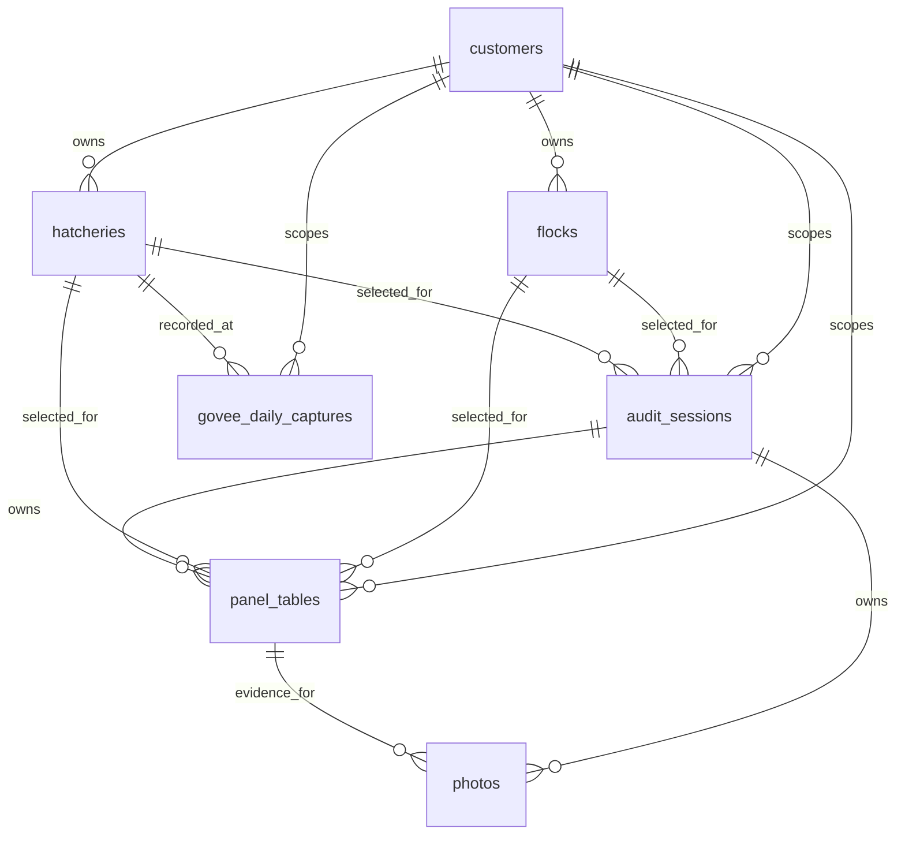

# Database Spec

This spec describes the current implemented persistence model in the Flutter
codebase. The current code is the primary source of truth.

Primary implementation files:

- `lib/data/database/database_helper.dart`
- `lib/data/database/database_schema.dart`
- `lib/data/models/panel_sample_schema.dart`
- `lib/data/models/panel_sample_model.dart`
- `lib/data/repositories/panel_sample_repository.dart`
- `lib/data/repositories/panel_dashboard_repository.dart`
- `lib/services/supabase/startup_sync_service.dart`
- `lib/services/supabase/supabase_service.dart`

Old generated specs are intentionally not used.

## Runtime

- Engine: SQLite through `sqflite`.
- Current schema version: `41`.
- Database file: `hatchaudit.db`.
- Cutover behavior: upgrades to v41 are destructive and rebuild the fresh
  schema. Old local audit history is not migrated.
- Fresh install schema: no `audits`, no `sample_records`, no sample detail
  tables, and no `{panel}_samples` child tables.
- Local-first behavior: SQLite is the operational source. Supabase sync mirrors
  the current table set on a best-effort basis.

## High-Level Model

`panel_tables` means any implemented station/panel table:
`egg_storage`, `egg_quality`, `chick_quality`, `chick_weights`,
`fresh_egg_breakout`, `candled_egg_breakout`, `residue_breakout`,
`setter_optimizing`, or `hatcher_optimizing`.

Each panel table is the only source of truth for that panel. A single sample is
one row in the panel table. Multi-sample screens write one row per sampled leaf
and identify each row with explicit nullable hierarchy columns:
`house`, `setter`, `hatcher`, `trolley`, `tray`, and `position`. A sample is a
row, not a separate child-table record or generic mode.

## Table Catalog

Fresh databases create these tables:

- Identity and ownership: `users`, `customers`, `hatcheries`, `flocks`
- Visit container: `audit_sessions`
- Panel tables:
  - `egg_storage`
  - `egg_quality`
  - `chick_quality`
  - `chick_weights`
  - `fresh_egg_breakout`
  - `candled_egg_breakout`
  - `residue_breakout`
  - `setter_optimizing`
  - `hatcher_optimizing`
- Govee captures: `govee_daily_captures`
- Reference data: `bmk_breeds`, `bmk_egg_breakout`, `troubleshooting`
- Supporting data: `photos`, `activity_log`, `sync_tombstones`

Removed tables:

- `audits`
- `sample_records`
- `sample_house_details`
- `sample_machine_details`
- `sample_batch_details`
- `sample_timing_details`
- all `{panel}_samples` tables
- legacy `station_samples`

## Core Tables

### `users`

Local user/profile state:

- `id TEXT PRIMARY KEY`
- `fullName TEXT`
- `email TEXT UNIQUE`
- `role TEXT`
- `status TEXT`
- `customerId TEXT`
- `accessToken TEXT`
- `tokenExpiry TEXT`
- `createdAt TEXT`
- `lastLoginAt TEXT`

### `customers`

Top-level customer account/entity:

- `id TEXT PRIMARY KEY`
- `name TEXT`
- `location TEXT`
- `phone TEXT`
- `email TEXT`
- `createdAt TEXT`
- `createdBy TEXT`

### `hatcheries`

Customer-owned hatchery/location:

- `id TEXT PRIMARY KEY`
- `customerId TEXT NOT NULL`
- `name TEXT NOT NULL`
- `location TEXT`
- `notes TEXT`
- `createdAt TEXT`
- `createdBy TEXT`

### `flocks`

Customer-owned flock:

- `id TEXT PRIMARY KEY`
- `customerId TEXT`
- `flockId TEXT`
- `breed TEXT`
- `entryDate TEXT`
- `isAgeEstimated INTEGER NOT NULL DEFAULT 0`
- `status TEXT NOT NULL DEFAULT 'active'`
- `depletionAgeWeeks INTEGER NOT NULL DEFAULT 65`
- `soldAt TEXT`

### `audit_sessions`

Visit-level container for selected customer, hatchery, flock, station order,
station completion, notes, and visit summary payloads:

- `id TEXT PRIMARY KEY`
- `customerId TEXT NOT NULL`
- `flockId TEXT NOT NULL`
- `hatcheryId TEXT NOT NULL`
- `date TEXT NOT NULL`
- `breed TEXT`
- `flockAgeWeeks INTEGER`
- `status TEXT DEFAULT 'in_progress'`
- `selectedStationKeys TEXT`
- `stationsCompleted TEXT`
- `findingsJson TEXT`
- `scorecardJson TEXT`
- `notes TEXT`
- `createdBy TEXT`
- `createdAt TEXT`
- `updatedAt TEXT`
- `completedAt TEXT`

`audit_sessions` is not a measurement table. It owns the visit workflow only.

## Panel Table Common Columns

Every panel table has the same ownership, explicit sample hierarchy,
storage/BMK context, metadata, and sync columns.

| Column | Why it exists | Current UI/workflow mapping |
| --- | --- | --- |
| `id TEXT PRIMARY KEY` | Stable row identity for local upsert, sync, tombstones, and photo links. | Generated from session, panel name, and draft/sample identity. |
| `sessionId TEXT NOT NULL` | Visit ownership. | Active `audit_sessions.id`. |
| `customerId TEXT NOT NULL` | Customer scope and dashboard filter. | Selected visit customer. |
| `flockId TEXT` | Flock filter and BMK context. | Selected visit flock. |
| `hatcheryId TEXT` | Hatchery filter and Govee context. | Selected visit hatchery. |
| `date TEXT NOT NULL` | Visit date and dashboard time filter. | Visit/session date. |
| `breed TEXT` | Dashboard and BMK context. | Visit breed or station machine breed field when shown. |
| `flockAgeWeeks INTEGER` | BMK age context. | Visit flock age. |
| `house TEXT` | Optional house identity. | House samples, Fresh Egg tray context, Candled/Residue parent context. |
| `setter TEXT` | Optional setter identity. | Setter samples and Candled/Residue machine context. |
| `hatcher TEXT` | Optional hatcher identity. | Hatcher samples and Candled/Residue machine context. |
| `trolley TEXT` | Optional trolley identity. | Candled/Residue tray hierarchy when entered. |
| `tray TEXT` | Optional tray identity. | Breakout tray rows and any tray-level panel UI. |
| `position TEXT` | Optional position identity. | Candled/Residue tray position. |
| `storagePeriodDays INTEGER` | Storage period context. | Egg storage and breakout BMK calculations. |
| `bmkAgeDays INTEGER` | Calculated BMK age in days. | Fresh/Candled/Residue breakout benchmark lookup. |
| `bmkAgeWeeks INTEGER` | Rounded BMK age in weeks. | BMK/dashboard filtering and display. |
| `notes TEXT` | Station-level notes. | Notes field on the station screen. |
| `createdAt TEXT NOT NULL` | Local creation timestamp. | Draft/station save timestamp. |
| `updatedAt TEXT NOT NULL` | Conflict resolution and dashboard freshness. | Updated on each station save. |
| `syncStatus TEXT NOT NULL DEFAULT 'pending'` | Supabase push queue state. | Set locally before startup sync. |
| `lastSyncedAt TEXT` | Successful remote sync timestamp. | Set by sync after push/pull. |
| `syncError TEXT` | Last sync failure detail. | Set by sync failure handling. |

Each panel table has these indexes:

- `idx_{panel}_session(sessionId)`
- `idx_{panel}_dashboard(customerId, flockId, date)`
- `idx_{panel}_unique_row(sessionId, IFNULL(house, ''), IFNULL(setter, ''), IFNULL(hatcher, ''), IFNULL(trolley, ''), IFNULL(tray, ''), IFNULL(position, ''))`

The unique row index prevents duplicate rows for the same sampled hierarchy
inside a visit session.

## Panel Measurement Columns

These columns are derived from the current screens, provider save flow, and
dashboard queries.

### `egg_storage`

UI fields: Egg storage days, EST readings, shell temperature, turning, tray
spacing, cooler proximity, condensation, upside-down score, station notes.

User-entered or captured columns:

- `estReadingsJson TEXT`
- `shellTemp REAL`
- `turningTimes INTEGER`
- `traySpacing TEXT`
- `coolerProximity TEXT`
- `condensationPresent INTEGER`
- `upsideDownCount INTEGER`

Calculated/dashboard columns:

- `estAvg REAL`
- `estCvPct REAL`
- `upsideDownPct REAL`

### `egg_quality`

UI fields: UV tray inspection, cuticle damage, washing evidence, dirt/fecal
evidence, tray totals, and 100-egg weight grid.

User-entered columns:

- `eggWeightsJson TEXT`
- `eggSampleSize INTEGER`

Calculated/dashboard columns:

- `uvTrayEggCount INTEGER`
- `uvCuticleDamageCount INTEGER`
- `uvWashedCount INTEGER`
- `uvDirtyCount INTEGER`
- `uvAffectedCount INTEGER`
- `uvAffectedPct REAL`
- `eggAvgWeight REAL`
- `eggUniformityPct REAL`
- `eggCvPct REAL`
- `eggBmkAgeWeeks INTEGER`
- `eggBmkWeight REAL`

### `chick_quality`

UI fields: Pasgar, YFBM, Chick Vent Temperature, PM Necropsy, and Culled
Chicks Analysis.

User-entered or captured columns:

- `pasgarSampleSize INTEGER`
- `pasgarReflexesCount INTEGER`
- `pasgarBeakCount INTEGER`
- `pasgarNavelCount INTEGER`
- `pasgarBellyCount INTEGER`
- `pasgarLegCount INTEGER`
- `pasgarFeatherDevCount INTEGER`
- `yfbmEntriesJson TEXT`
- `cvtReadingsJson TEXT`
- `cvtSampleSize INTEGER`
- `pmSampleSize INTEGER`
- `pmCollectionPoint TEXT`
- `pmOmphalitisCount INTEGER`
- `pmOmphalitisSeverity TEXT`
- `pmGaseousCecaCount INTEGER`
- `pmGaseousCecaSeverity TEXT`
- `pmGizzardErosionsCount INTEGER`
- `pmGizzardErosionsSeverity TEXT`
- `pmAirSacCaseationsCount INTEGER`
- `pmAirSacCaseationsSeverity TEXT`
- `pmUrolithiasisCount INTEGER`
- `pmUrolithiasisSeverity TEXT`
- `pmNephritisCount INTEGER`
- `pmNephritisSeverity TEXT`
- `pmGeneralSepticemiaCount INTEGER`
- `pmGeneralSepticemiaSeverity TEXT`
- `pmOtherLesionsJson TEXT`
- `pmSuspectedCauseAuto TEXT`
- `pmSuspectedCauseManual TEXT`
- `culledChicksTotalEggSet INTEGER`
- `culledChicksAnalysisJson TEXT`

`culledChicksAnalysisJson` stores defect subtype percentages (`pct`) calculated
from the total egg set denominator; raw defect row counts are not persisted.

Calculated/dashboard columns:

- `pasgarReflexesPct REAL`
- `pasgarBeakPct REAL`
- `pasgarNavelPct REAL`
- `pasgarBellyPct REAL`
- `pasgarLegPct REAL`
- `pasgarFeatherDevPct REAL`
- `pasgarFinalScore REAL`
- `yfbmEntryCount INTEGER`
- `yfbmAvgPct REAL`
- `yfbmCvPct REAL`
- `cvtAvgTemp REAL`
- `cvtCvPct REAL`
- `culledChicksAffectedPct REAL`
- `culledChicksTopCategory TEXT`
- `culledChicksTopSubtype TEXT`

### `chick_weights`

UI fields: chick weight grid.

User-entered columns:

- `weightsJson TEXT`
- `sampleSize INTEGER`

Calculated/dashboard columns:

- `avgWeight REAL`
- `uniformityPct REAL`
- `cvPct REAL`
- `bmkWeight REAL`

### `fresh_egg_breakout`

UI fields: storage period, calculated BMK age, house/tray identity, tray size,
fresh breakout counts.

User-entered columns:

- `traySize INTEGER`
- `infertileCount INTEGER`
- `early24hCount INTEGER`
- `early48hCount INTEGER`
- `bloodRingCount INTEGER`

Calculated/dashboard columns:

- `infertilePct REAL`
- `early24hPct REAL`
- `early48hPct REAL`
- `bloodRingPct REAL`
- `infertileDiffPct REAL`
- `early24hDiffPct REAL`
- `early48hDiffPct REAL`
- `bloodRingDiffPct REAL`

### `candled_egg_breakout`

UI fields: storage period, calculated BMK age, candling day, tray hierarchy,
tray size, candled breakout counts.

User-entered columns:

- `candlingDay INTEGER`
- `traySize INTEGER`
- `infertileCount INTEGER`
- `early24hCount INTEGER`
- `early48hCount INTEGER`
- `bloodRingCount INTEGER`
- `blackEyeCount INTEGER`

Calculated/dashboard columns:

- `infertilePct REAL`
- `early24hPct REAL`
- `early48hPct REAL`
- `bloodRingPct REAL`
- `blackEyePct REAL`
- `infertileDiffPct REAL`
- `early24hDiffPct REAL`
- `early48hDiffPct REAL`
- `bloodRingDiffPct REAL`
- `blackEyeDiffPct REAL`

### `residue_breakout`

UI fields: storage period, calculated BMK age, full tray hierarchy, tray size,
residue counts, hatch results totals.

User-entered columns:

- `traySize INTEGER`
- `infertileCount INTEGER`
- `earlyDeadCount INTEGER`
- `midDeadCount INTEGER`
- `lateDeadCount INTEGER`
- `externalPipCount INTEGER`
- `crackedCount INTEGER`
- `contaminatedCount INTEGER`
- `totalEggsSet INTEGER`
- `hatchedCount INTEGER`
- `culledCount INTEGER`
- `deadCount INTEGER`

Calculated/dashboard columns:

- `infertilePct REAL`
- `earlyDeadPct REAL`
- `midDeadPct REAL`
- `lateDeadPct REAL`
- `externalPipPct REAL`
- `crackedPct REAL`
- `contaminatedPct REAL`
- `infertileDiffPct REAL`
- `earlyDeadDiffPct REAL`
- `midDeadDiffPct REAL`
- `lateDeadDiffPct REAL`
- `externalPipDiffPct REAL`
- `crackedDiffPct REAL`
- `contaminatedDiffPct REAL`
- `hatchabilityPct REAL`
- `fertilityPct REAL`
- `hofPct REAL`
- `culledPct REAL`
- `deadPct REAL`

### `setter_optimizing`

UI fields: setter hierarchy identity, machine type, setpoint/actual screen
values, batch size, batch count, total eggs set, turning angle, CO2, breed,
incubation age/hour, EST readings.

User-entered or captured columns:

- `machineType TEXT`
- `setpointF REAL`
- `actualF REAL`
- `batchSize INTEGER`
- `batchCount INTEGER`
- `totalEggsSet INTEGER`
- `turningAngle REAL`
- `co2Ppm REAL`
- `estBreed TEXT`
- `incubationAgeDays INTEGER`
- `incubationHours INTEGER`
- `estReadingsJson TEXT`

Calculated/dashboard columns:

- `estSampleSize INTEGER`
- `estAvg REAL`
- `estCvPct REAL`

### `hatcher_optimizing`

UI fields: hatcher hierarchy identity, incubation age/hour, CO2, CVT readings,
chick panting, meconium.

User-entered or captured columns:

- `incubationAgeDays INTEGER`
- `incubationHours INTEGER`
- `co2Ppm REAL`
- `cvtReadingsJson TEXT`
- `chickPanting INTEGER`
- `meconium TEXT`

Calculated/dashboard columns:

- `cvtSampleSize INTEGER`
- `cvtAvg REAL`
- `cvtCvPct REAL`

## Scope Support By Panel

Scope rows are hierarchical. If a sector records a deeper scope, the row keeps
all populated parent hierarchy columns in order: `house`, machine
(`setter`/`hatcher`), `trolley`, then `tray`. If no scope is selected, the row
is station-scoped and leaves the hierarchy columns null.

| Panel | Allowed scopes |
| --- | --- |
| `egg_storage` | `pool`, `house` |
| `egg_quality` | `pool`, `house`, `setter_hatcher` |
| `chick_quality` | `pool`, `house`, `setter_hatcher` |
| `chick_weights` | `pool`, `house` |
| `fresh_egg_breakout` | `pool`, `house`, `tray` |
| `candled_egg_breakout` | `pool`, `house`, `setter`, `tray` |
| `residue_breakout` | `pool`, `house`, `setter_hatcher`, `tray`, `batch` |
| `setter_optimizing` | `pool`, `setter`, `trolley`, `tray` |
| `hatcher_optimizing` | `pool`, `hatcher`, `trolley`, `tray` |

## Photos

Photos no longer depend on an audit row.

Columns:

- `id TEXT PRIMARY KEY`
- `filePath TEXT`
- `description TEXT`
- `createdAt TEXT`
- `sessionId TEXT NOT NULL`
- `panelName TEXT NOT NULL`
- `panelRowId TEXT NOT NULL`
- `fieldKey TEXT NOT NULL`
- `uploadStatus TEXT NOT NULL DEFAULT 'local'`

Photo identity:

- `sessionId`: visit container.
- `panelName`: panel/table name such as `egg_storage`.
- `panelRowId`: panel row id.
- `fieldKey`: measurement or evidence field, such as `photo`, `est`, `cvt`,
  or `co2`.

## Dashboard Rules

Dashboard queries read panel tables directly through
`PanelDashboardRepository`. Dashboard code does not read the removed `audits`
table or removed sample tables.

Dashboard-ready summary columns are stored on panel rows where the current UI
already calculates them during save. Examples include `avgWeight`, `cvPct`,
`uniformityPct`, `finalScore`, breakout percentages, hatchability/fertility/HOF,
`estAvg`, and `cvtAvg`.

## Sync Rules

Startup sync pushes and pulls the current table set in dependency order:

1. `customers`
2. `hatcheries`
3. `flocks`
4. `audit_sessions`
5. panel tables
6. `govee_daily_captures`
7. `photos`
8. `sync_tombstones`

Removed tables are not pushed or pulled. Tombstones support panel tables and
photos directly.

## Removed Fields And Safe Deletions

The following legacy storage is intentionally gone from the fresh schema and
startup sync:

- Wide station columns on `audits`, including `es_*`, `chick*`, `ha*`, `so*`,
  and `ho*`.
- `sample_records` and all sample detail tables.
- All `{panel}_samples` tables.
- `photos.auditId`.

The current UI still uses legacy-named in-memory draft models in several
screens as compatibility form state, but persistence converts those drafts into
panel rows at save time.
