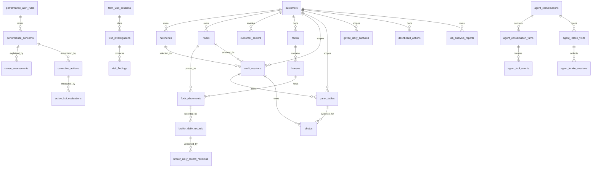

# Database Spec

This spec describes the current implemented persistence model in the Flutter
codebase. The current code is the primary source of truth.

Primary implementation files:

- `lib/data/database/database_helper.dart` — open path, version, `_onCreate`
- `lib/data/database/database_schema.dart` — all DDL
- `lib/data/database/database_migrations.dart` — `_onUpgrade` handlers
- `lib/data/models/panel_sample_schema.dart` — panel table generator input
- `lib/data/models/panel_sample_model.dart` — `PanelRecord` runtime shape
- `lib/data/repositories/panel_sample_repository.dart`
- `lib/data/repositories/panel_dashboard_repository.dart`
- `lib/data/repositories/performance_sync_repository.dart` — sync table order
- `lib/services/supabase/startup_sync_service.dart`
- `lib/services/supabase/supabase_service.dart`
- `lib/services/supabase/sync_meta.dart`
- `supabase/migrations/*.sql` — the cloud mirror

Old generated specs are intentionally not used.

## Runtime

- Engine: SQLite through `sqflite`. Database file: `hatchaudit.db`.
- Current schema version: `62`.
- Columns are camelCase locally. The Supabase mirror is snake_case; conversion
  happens at the sync boundary, not in the repositories.
- Local-first: SQLite is the operational source. Supabase mirrors it.
- `onConfigure` disables foreign keys, `onOpen` re-enables them after repair.
- `onOpen` runs, in order: surgical schema repair, panel unique-index drop,
  deprecated panel column drop, panel column reconciliation, panel query
  indexes, panel unique indexes, telegram staff link indexes, then the
  operational BMK seed-source backfill.
- Panel tables are reconciled on every open, so a panel column added to
  `PanelSampleSchema` lands without a version bump.
- In debug builds only, a corrupt/unopenable database file is deleted and
  recreated. Release builds rethrow.

## Storage layers

| Layer | Contents |
| --- | --- |
| SQLite (device) | 63 tables, camelCase, offline source of truth |
| Supabase Postgres | same graph, snake_case, RLS scoped per customer |
| Supabase Edge functions | `telegram-hatchery-agent`, `app-hatchery-agent`, `approve-agent-intake`, `create-customer-account`, `reset-customer-password` |

Tenant-owned cloud child tables carry a server-derived `customer_id` that is
intentionally absent from the local row shape: a before-write trigger derives it
from the authoritative parent edge and rejects cross-customer links.

## High-Level Model



`panel_tables` means any implemented station/panel table: `egg_storage`,
`egg_quality`, `chick_quality`, `chick_weights`, `fresh_egg_breakout`,
`candled_egg_breakout`, `residue_breakout`, `setter_optimizing`, or
`hatcher_optimizing`.

Each panel table is the only source of truth for that panel. A single sample is
one row. Multi-sample screens write one row per sampled leaf and identify each
row with explicit nullable hierarchy columns. A sample is a row, not a separate
child-table record or generic mode.

## Table Catalog

Fresh databases create 61 tables, in these groups:

| Group | Tables |
| --- | --- |
| Identity and ownership | `users`, `customers`, `hatcheries`, `flocks` |
| Farm hierarchy | `customer_sectors`, `farms`, `houses`, `flock_placements` |
| Visit container | `audit_sessions` |
| Panels (9) | `egg_storage`, `egg_quality`, `chick_quality`, `chick_weights`, `fresh_egg_breakout`, `candled_egg_breakout`, `residue_breakout`, `setter_optimizing`, `hatcher_optimizing` |
| Environment captures | `govee_daily_captures` |
| Corrective action workflow | `dashboard_actions` |
| Lab analysis | `lab_analysis_reports`, `lab_analysis_groups`, `lab_analysis_rows` |
| Broiler daily records | `broiler_daily_records`, `broiler_daily_record_revisions`, `broiler_daily_events`, `daily_record_sources` |
| Broiler objectives | `broiler_target_profiles`, `broiler_target_rows` |
| Performance monitoring | `performance_alert_rules`, `performance_concerns` |
| Diagnostic farm visits | `farm_visit_sessions`, `farm_visit_houses`, `visit_investigations`, `visit_findings`, `cause_assessments`, `corrective_actions`, `action_kpi_evaluations` |
| Agent — document intake | `telegram_staff_links`, `agent_settings`, `agent_submissions`, `agent_questions`, `hatchery_draft_batches`, `hatchery_draft_rows`, `hatchery_agent_audit_events`, `hatchery_daily_records` |
| Agent — conversational harness | `agent_conversations`, `agent_conversation_turns`, `agent_tool_events`, `agent_intake_visits`, `agent_intake_sessions`, `agent_intake_turns`, `agent_intake_values` |
| Reference data | `bmk_breeds`, `bmk_egg_breakout`, `bmk_operational_standards`, `troubleshooting` |
| Supporting data | `photos`, `activity_log`, `sync_tombstones`, `sync_conflicts` |

Removed tables: `audits`, `sample_records`, `sample_house_details`,
`sample_machine_details`, `sample_batch_details`, `sample_timing_details`, all
`{panel}_samples` tables, legacy `station_samples`.

## Core Tables

### `users`

Local user/profile state. The only syncable-looking table with no sync columns —
identity is owned by Supabase auth, not by row sync.

`id`, `fullName`, `email UNIQUE`, `role`, `status`, `customerId`, `accessToken`,
`tokenExpiry`, `createdAt`, `lastLoginAt`.

### `customers`

Top-level customer account: `id`, `name`, `location`, `phone`, `email`,
`createdAt`, `createdBy`, plus sync columns.

### `hatcheries`

Customer-owned hatchery/location: `id`, `customerId NOT NULL`, `name NOT NULL`,
`location`, `notes`, `createdAt`, `createdBy`, plus sync columns.
Indexed on `customerId`.

### `flocks`

Customer-owned flock. `flockId` is the human label, `id` is the row key.

`id`, `customerId`, `flockId`, `breed`, `entryDate`, `farmId`, `sectorKey`,
`sexProfile NOT NULL DEFAULT 'as_hatched'`, `targetProfileId`, `productionPhase`,
`isAgeEstimated NOT NULL DEFAULT 0`, `status NOT NULL DEFAULT 'active'`,
`depletionAgeWeeks NOT NULL DEFAULT 65`, `soldAt`, `updatedAt`, plus sync
columns. Indexed on `(customerId, status)`.

`updatedAt` exists locally but not in the cloud `flocks` table, so the push path
strips it before upload.

### `audit_sessions`

Visit-level container for selected customer, hatchery, flock, station order,
station completion, notes, and visit summary payloads:

`id`, `customerId NOT NULL`, `flockId NOT NULL`, `hatcheryId NOT NULL`,
`date NOT NULL`, `breed`, `flockAgeWeeks`, `status DEFAULT 'in_progress'`,
`selectedStationKeys`, `stationsCompleted`, `findingsJson`, `scorecardJson`,
`notes`, `createdBy`, `createdAt`, `updatedAt`, `completedAt`, plus sync columns.

Indexed on `(customerId, date DESC)`, `(flockId, date DESC)`, `(syncStatus)`.

`audit_sessions` is not a measurement table. It owns the visit workflow only.

## Farm Hierarchy

| Table | Shape |
| --- | --- |
| `customer_sectors` | `customerId` + `sectorKey`, unique together, `isActive` |
| `farms` | `customerId`, `sectorKey`, `name`, `location`, `notes`, `isActive`, `createdBy` |
| `houses` | `farmId`, `name`, `code`, `capacity`, `notes`, `isActive` — `name` and `code` are each unique per farm |
| `flock_placements` | `flockId`, `houseId`, `placedBirds`, `placedAt`, `endedAt`, `status` in `active`/`ended`/`transferred`, `notes` |

`flock_placements` carries a unique partial index allowing only one `active`
placement per house.

Sector keys come from `PoultrySector` in
`lib/data/models/poultry_hierarchy_models.dart`.

## Panel Table Common Columns

Panel tables are generated from `PanelSampleSchema.panels`. Every panel table
gets the same envelope, then its own measurement columns appended:

| Column | Why it exists | Current UI/workflow mapping |
| --- | --- | --- |
| `id TEXT PRIMARY KEY` | Stable row identity for local upsert, sync, tombstones, and photo links. | Generated from session, panel name, and draft/sample identity. |
| `sessionId TEXT NOT NULL` | Visit ownership. | Active `audit_sessions.id`. |
| `customerId TEXT NOT NULL` | Customer scope and dashboard filter. | Selected visit customer. |
| `flockId TEXT` | Flock filter and BMK context. | Selected visit flock. |
| `hatcheryId TEXT` | Hatchery filter and Govee context. | Selected visit hatchery. |
| `date TEXT NOT NULL` | Visit date and dashboard time filter. | Visit/session date. |
| `breed TEXT` | Dashboard and BMK context. | Visit breed or station machine breed field when shown. |
| `flockAgeWeeks INTEGER` | BMK age context. | Visit flock age. |
| `house TEXT` | Optional house identity. | House samples, Fresh Egg tray context, Candled/Residue parent context. |
| `setter TEXT` | Optional setter identity. | Setter samples and Candled/Residue machine context. |
| `hatcher TEXT` | Optional hatcher identity. | Hatcher samples and Candled/Residue machine context. |
| `trolley TEXT` | Optional trolley identity. | Candled/Residue tray hierarchy when entered. |
| `tray TEXT` | Optional tray identity. | Breakout tray rows and any tray-level panel UI. |
| `position TEXT` | Optional position identity. | Candled/Residue tray position. |
| `storagePeriodDays INTEGER` | Storage period context. | Egg storage and breakout BMK calculations. |
| `bmkAgeWeeks INTEGER` | Rounded BMK age in weeks. | BMK/dashboard filtering and display. |
| `sampleMode TEXT` | v61: what this row represents (recorded explicitly instead of re-inferred from hierarchy columns on reopen). Nullable, unread as of v61. | Not yet wired to any screen. |
| `scopeType TEXT` | v61: comparison-row scope identity. Nullable, unread as of v61. | Not yet wired to any screen. |
| `sampleLabel TEXT` | v61: display label for the sample/row. Nullable, unread as of v61. | Not yet wired to any screen. |
| `sampleIndex INTEGER` | v61: ordinal position of the sample within its scope. Nullable, unread as of v61. | Not yet wired to any screen. |
| `sourceDomain TEXT` | v61: which side of the operation owns the measurement. Free text, no fixed vocabulary yet. Nullable, unread as of v61. | Not yet wired to any screen. |
| `actionDomain TEXT` | v61: which side of the operation owns the fix. Free text, no fixed vocabulary yet. Nullable, unread as of v61. | Not yet wired to any screen. |
| `recommendationTarget TEXT` | v61: which side of the operation owns the recommendation. Free text, no fixed vocabulary yet. Nullable, unread as of v61. | Not yet wired to any screen. |
| `notes TEXT` | Station-level notes. | Notes field on the station screen. |
| `createdAt TEXT NOT NULL` | Local creation timestamp. | Draft/station save timestamp. |
| `updatedAt TEXT NOT NULL` | Conflict resolution and dashboard freshness. | Updated on each station save. |
| `syncStatus TEXT NOT NULL DEFAULT 'pending'` | Supabase push queue state. | Set locally before startup sync. |
| `dirtyAt TEXT` | When the row was last locally edited. | Drives dirty-row selection and the mark-synced cutoff. |
| `lastSyncedAt TEXT` | Successful remote sync timestamp. | Set by sync after push/pull. |
| `syncError TEXT` | Last sync failure detail. | Set by sync failure handling. |

`setter_optimizing` and `hatcher_optimizing` are the exceptions: they override
`hierarchyColumnDefinitions` and carry only `setter` or only `hatcher`. The open
path drops any hierarchy column a panel no longer declares, plus the retired
`bmkAgeDays`.

Each panel table has these indexes:

- `idx_{panel}_session(sessionId)`
- `idx_{panel}_dashboard(customerId, flockId, date)`
- `idx_{panel}_sync(syncStatus)`
- `idx_{panel}_unique_row(sessionId, IFNULL(<each declared hierarchy column>, ''))`
  — **except `egg_quality`** (see below).

The unique row index prevents duplicate rows for the same sampled hierarchy
inside a visit session.

`egg_quality` is id-keyed instead: as of v61 it carries no
`idx_egg_quality_unique_row` index, and row identity for save/upsert is the
row's own `id`, never the hierarchy tuple
(`PanelSampleSchema.idKeyedPanelTables`, referenced by
`PanelSampleRepository.idKeyedPanelTables`). A comparison row may legitimately
have a blank or duplicated `house`; matching on hierarchy made two such rows
overwrite each other. `_ensurePanelUniqueRowIndexes` drops the index on open
for any pre-v61 database that still has it.

### `PanelRecord`

`PanelRecord` is the in-memory shape the save path and dashboard use. It carries
the envelope fields plus presentation state that is not persisted as columns:
`mode` (`pool` or `comparison`), `scopeType` (a `SamplingLayer`), `scopeLabel`,
`sampleIndex`, `groupKey`, `groupLabel`, and an open `values` map holding the
panel's measurement columns.

## Panel Measurement Columns

These columns are derived from the current screens, provider save flow, and
dashboard queries.

### `egg_storage`

UI fields: Egg storage days, EST readings, turning, tray spacing, cooler
proximity, condensation, upside-down score, station notes.

User-entered or captured: `estReadingsJson`, `turningTimes`, `traySpacing`,
`coolerProximity`, `condensationPresent`, `upsideDownCount`.

Calculated/dashboard: `estAvg`, `estCvPct`, `upsideDownPct`.

Egg storage temperatures are recorded in °C.

### `egg_quality`

UI fields: UV tray inspection, cuticle damage, washing evidence, dirt/fecal
evidence, tray totals, and the egg weight grid.

User-entered: `uvTrayEggCount`, `uvCuticleDamageCount`, `uvWashedCount`,
`uvDirtyCount`, `eggWeightsJson`, `eggSampleSize`.

Calculated/dashboard: `uvCuticleDamagePct`, `uvWashedPct`, `uvDirtyPct`,
`uvAffectedCount`, `uvAffectedPct`, `eggAvgWeight`, `eggUniformityPct`,
`eggCvPct`, `eggBmkAgeWeeks`, `eggBmkWeight`.

As of v62, `egg_quality` also carries eight nullable visual-grading summary
columns, derived from the sample's rows in `egg_quality_defect_counts` (see
below) and written back onto the parent for fast dashboard reads:
`gradingSampleSize`, `gradingRejectedCount`, `gradingAcceptableCount`,
`gradingRejectedPct`, `gradingAcceptablePct`, `gradingDefectsJson`,
`gradingTopDefectCode`, `gradingTopDefectPct`. One egg may carry several
defects, so there is deliberately no constraint tying the sum of per-defect
counts to `gradingSampleSize`; `gradingAcceptableCount` is simply
`gradingSampleSize - gradingRejectedCount`.

### `chick_quality`

UI fields: Pasgar, YFBM, Chick Vent Temperature, PM Necropsy, Culled Chicks
Analysis.

User-entered or captured: `pasgarSampleSize`, the six Pasgar defect counts
(`pasgarReflexesCount`, `pasgarBeakCount`, `pasgarNavelCount`,
`pasgarBellyCount`, `pasgarLegCount`, `pasgarFeatherDevCount`), `yfbmPhoto`,
`yfbmEntriesJson`, `cvtReadingsJson`, `cvtPhotosJson`, `cvtSampleSize`, the
per-basket CVT triples (`cvtTopBasket`/`cvtTopTemp`/`cvtTopPhoto` and the middle
and bottom equivalents), `pmSampleSize`, `pmCollectionPoint`, the seven PM lesion
count/severity pairs (`pmOmphalitis*`, `pmGaseousCeca*`, `pmGizzardErosions*`,
`pmAirSacCaseations*`, `pmUrolithiasis*`, `pmNephritis*`,
`pmGeneralSepticemia*`), `pmOtherLesionsJson`, `pmSuspectedCauseManual`,
`pmPhotosJson`, `culledChicksTotalEggSet`, `culledChicksAnalysisJson`.

`culledChicksAnalysisJson` stores defect subtype percentages (`pct`) calculated
from the total egg set denominator; raw defect row counts are not persisted.

Calculated/dashboard: the six Pasgar pcts, `pasgarFinalScore`, `yfbmEntryCount`,
`yfbmAvgPct`, `yfbmCvPct`, `cvtAvgTemp`, `cvtCvPct`, `pmSuspectedCauseAuto`,
`culledChicksAffectedPct`, `culledChicksTopCategory`, `culledChicksTopSubtype`.

CVT temperatures are recorded in °F.

### `chick_weights`

UI fields: chick weight grid.

User-entered: `weightsJson`, `sampleSize`.

Calculated/dashboard: `avgWeight`, `uniformityPct`, `cvPct`, `bmkWeight`.

### `fresh_egg_breakout`

UI fields: storage period, calculated BMK age, house/tray identity, tray size,
fresh breakout counts.

User-entered: `traySize`, `infertileCount`, `early24hCount`, `early48hCount`,
`bloodRingCount`.

Calculated/dashboard: `infertilePct`, `early24hPct`, `early48hPct`,
`bloodRingPct`, and the matching `*DiffPct` columns (row value minus BMK).

### `candled_egg_breakout`

Same as fresh breakout plus `candlingDay`, `blackEyeCount`, `blackEyePct`,
`blackEyeDiffPct`.

### `residue_breakout`

UI fields: storage period, calculated BMK age, full tray hierarchy, tray size,
residue counts, hatch results totals.

User-entered: `traySize`, `infertileCount`, `earlyDeadCount`, `midDeadCount`,
`lateDeadCount`, `externalPipCount`, `crackedCount`, `contaminatedCount`,
`totalEggsSet`, `hatchedCount`, `culledCount`, `deadCount`.

Calculated/dashboard: the seven defect pcts and their `*DiffPct` counterparts,
plus `hatchabilityPct`, `fertilityPct`, `hofPct`, `culledPct`, `deadPct`.

### `setter_optimizing`

UI fields: setter identity, machine type, setpoint/actual screen values, batch
size, batch count, total eggs set, turning angle, CO2, breed, incubation
age/hour, EST readings.

User-entered or captured: `machineType`, `setpointF`, `actualF`, `setpointRh`,
`actualRh`, `batchSize`, `batchCount`, `totalEggsSet`, `turningAngle`, `co2Ppm`,
`co2Photo`, `estBreed`, `incubationAgeDays`, `incubationHours`,
`estReadingsJson`, `estPhotosJson`, `estSamplesJson`, `machineScreenPhoto`.

Calculated/dashboard: `estSampleSize`, `estAvg`, `estCvPct`.

Setter temperatures are recorded in °F.

### `hatcher_optimizing`

UI fields: hatcher identity, setpoints, incubation age/hour, CO2, CVT readings,
chick panting, meconium, transfer day.

User-entered or captured: `setpointF`, `setpointRh`, `incubationAgeDays`,
`incubationHours`, `co2Ppm`, `co2Photo`, `cvtReadingsJson`, `cvtPhotosJson`,
`chickPanting`, `chickPantingPhoto`, `meconium`, `transferDay`.

Calculated/dashboard: `cvtSampleSize`, `cvtAvg`, `cvtCvPct`.

Hatcher temperatures are recorded in °F.

## Egg Grading Tables

v62 adds visual egg grading, built on the `egg_quality` sample identity
(`PanelSampleSchema.idKeyedPanelTables`). Not panel tables themselves — plain
tables outside `PanelSampleSchema.panels`, so they are not reconciled by the
panel column pass and are registered directly in `_criticalTables` /
`_criticalColumns` instead.

### `egg_defect_types`

The defect catalogue, seeded from the Dart source of truth
(`kEggDefectTypes` in `lib/features/audits/models/egg_grading.dart`) by
`seedEggDefectTypes` on create, on the v62 upgrade hop, and again by
`_surgicalSchemaRepair` whenever the table is found missing (Step 2 creates
it via `createEggGradingTables`, Step 4 reseeds it — the same
missing-table-triggers-reseed pattern `troubleshooting` uses). Reseeding is
idempotent (`ConflictAlgorithm.replace` keyed by `id = 'egg-defect-<code>'`)
and never removes a code, because saved defect counts join on `code`.

Columns: `id`, `code` (unique in the `CREATE TABLE` DDL only — the
`_criticalColumns` repair definition omits `UNIQUE`, since SQLite rejects
`ALTER TABLE ... ADD COLUMN` with a `UNIQUE` constraint; a table that already
exists but is missing `code` gets it back as a plain column, not
re-uniqued), `name`, `category`, `isReject`, `description`, `imageAsset`,
`sortOrder`, `isActive`, `createdAt`, `updatedAt`.

### `egg_quality_defect_counts`

One row per defect code observed on an `egg_quality` sample — a child table
keyed by `(eggQualityId, defectCode)` (enforced by a unique index), with
`ON DELETE CASCADE` from `egg_quality`. **One egg may carry several
defects**, so `count` is an occurrence count, not a per-egg exclusive
bucket: there is deliberately no constraint tying `SUM(count)` to the
sample's `gradingSampleSize`. The auditor enters `gradingRejectedCount`
directly; acceptable eggs are `gradingSampleSize - gradingRejectedCount`.

Columns: `id`, `eggQualityId`, `sessionId`, `customerId`, `flockId`,
`hatcheryId`, `date`, `scopeType`, `houseKey`, `sampleLabel`, `defectCode`,
`defectCategory`, `isReject`, `count`, `pctOfSample`, `notes`, `sortOrder`,
`createdAt`, `updatedAt`, plus the standard sync columns (`syncStatus`,
`dirtyAt`, `lastSyncedAt`, `syncError`, all local-only and stripped before
upload).

Local camelCase columns snake_case onto the cloud `egg_quality_defect_counts`
table 1:1 (`supabase/migrations/20260823100000_egg_grading.sql`), except the
four local-only sync columns, which the cloud mirror does not carry.

## Scope Support By Panel

Scope rows are hierarchical. If a sector records a deeper scope, the row keeps
all populated parent hierarchy columns in order: `house`, machine
(`setter`/`hatcher`), `trolley`, then `tray`. If no scope is selected, the row is
station-scoped and leaves the hierarchy columns null.

The authoritative list is `allowedLayers` on each `PanelSampleDefinition`:

| Panel | Allowed layers |
| --- | --- |
| `egg_storage` | `pool` |
| `egg_quality` | `pool`, `house` |
| `chick_quality` | `pool`, `setter_hatcher` |
| `chick_weights` | `pool`, `house` |
| `fresh_egg_breakout` | `pool`, `house`, `tray` |
| `candled_egg_breakout` | `pool`, `house`, `setter_hatcher`, `trolley`, `tray` |
| `residue_breakout` | `pool`, `house`, `setter_hatcher`, `trolley`, `tray` |
| `setter_optimizing` | `setter` |
| `hatcher_optimizing` | `hatcher` |

`SamplingLayer` values: `pool`, `house`, `setter`, `hatcher`, `setter_hatcher`,
`trolley`, `tray`.

## Station To Panel Mapping

An audit station key selects one or more panel tables:

| Station key | Panel tables |
| --- | --- |
| `egg` | `egg_storage`, `egg_quality` |
| `chicks` | `chick_quality`, `chick_weights` |
| `hatch_analysis_egg_breakouts` | `fresh_egg_breakout`, `candled_egg_breakout`, `residue_breakout` |
| `setters` | `setter_optimizing` |
| `hatchers` | `hatcher_optimizing` |

## Photos

Photos do not depend on an audit row. Bytes live on disk; the row stores the
path.

Columns: `id`, `filePath`, `description`, `createdAt`, `sessionId NOT NULL`,
`panelName NOT NULL`, `panelRowId NOT NULL`, `fieldKey NOT NULL`,
`uploadStatus NOT NULL DEFAULT 'local'`.

Photo identity:

- `sessionId`: visit container.
- `panelName`: panel/table name such as `egg_storage`.
- `panelRowId`: panel row id.
- `fieldKey`: measurement or evidence field, such as `photo`, `est`, `cvt`, or
  `co2`.

Indexed on `(sessionId, panelName, panelRowId)`.

## Environment And Workflow Tables

### `govee_daily_captures`

One row per `(customerId, hatcheryId, place, machineId, captureDate)` — enforced
by a table-level `UNIQUE`. Carries `stationKey`, `startedAt`, `endedAt`,
`deviceId`, `deviceName`, `status`, temperature stats
(`tempAvg`/`Min`/`Max`/`Sd`/`CvPct`), humidity stats
(`rhAvg`/`Min`/`Max`/`Sd`/`CvPct`), `readingCount`, and `chartPointsJson`.

Govee readings are stored in °F and toggled for display.

### `dashboard_actions`

Persistent corrective actions derived from dashboard findings:

- Scope/source: `findingKey`, `customerId`, `hatcheryId`, optional `flockId`,
  `sessionId`, `panelName`, `panelRowId`, `fieldKey`, `metricKey`.
- Workflow: `title`, `description`, `priority` (`watch`/`critical`), `status`
  (`open`/`inProgress`/`resolved`/`reopened`), `ownerId`, `ownerName`, `dueAt`,
  `firstObservedAt`, `lastObservedAt`.
- Resolution: `resolvedAt`, `resolutionNotes`, `resolutionPhotoId`,
  `recurrenceOfId`.

Customer and hatchery deletion cascades actions. Flock and audit-session source
deletion clears the optional reference. Local changes are dirty-tracked,
conflict-checked, pushed/pulled, and explicitly tombstoned on delete.

### Lab analysis

Three levels, all denormalized with `customerId`/`flockId`/`reportDate` so the
dashboard can query any level directly:

- `lab_analysis_reports` — `labName`, `sampleType`, `flockAgeWeeks`, `title`,
  `notes`, and the PDF attachment triple `reportFileName`/`reportFilePath`/
  `reportFileRemotePath`.
- `lab_analysis_groups` — one analyte block: `testType`, `groupLabel`,
  `sampleScope`, `analyte`, `method`, `kitName`, `productCode`, `antigen`,
  `sampleCount`, `meanTiter`, `minTiter`, `maxTiter`, `gmtTiter`, `cvPct`,
  `positiveCount`/`negativeCount`/`positivePct`, `cutoffValue`, `cutoffTiter`,
  `gmLog2`, `protectiveThresholdLog2`, `protectiveCount`, `protectivePct`,
  `interpretation`, `severity`, `sortOrder`.
- `lab_analysis_rows` — one sample line: `rowLabel`, `analyte`, `result`,
  `resultCategory`, `numericValue`, `unit`, `ctValue`, `odValue`, `spRatio`,
  `titer`, `titerGroup`, `hiLog2`, `count`, `antibiotic`,
  `sensitivityCategory`, `interpretation`, `severity`, `sortOrder`.

## Broiler Daily Records

```
flock_placements
  └─ broiler_daily_records            (thin head, points at current revision)
       └─ broiler_daily_record_revisions   (immutable, append-only)
            ├─ broiler_daily_events
            └─ daily_record_sources
```

- `broiler_daily_records`: `placementId`, `recordDate`, `currentRevisionId`,
  `verificationStatus` in `pending_entry`/`entered`/`requires_clarification`/
  `corrected`. Unique per `(placementId, recordDate)`.
- `broiler_daily_record_revisions`: 65 columns, unique per
  `(recordId, revisionNumber)`, never updated after insert. Groups:
  - Provenance — `dataSourceType`, `sourceDescription`, `reportedBy`,
    `enteredBy`/`enteredAt`, `reviewedBy`/`reviewedAt`, `verifiedBy`/
    `verifiedAt`, `correctionReason`.
  - Population — `openingBirdCount`, `dailyMortality`, `dailyCulls`,
    `transfersIn`, `transfersOut`, `partialDepletion`,
    `otherPopulationAdjustment`, `mortalityCausesJson`, `closingLiveBirdCount`.
  - Feed — `dailyFeedConsumedKg`, `feedType`, `feedPhase`, `feedChange`,
    `feedInterruptionMinutes`, `feedShortage`.
  - Water — `waterConsumedLiters`, `flushingWaterLiters`,
    `waterInterruptionMinutes`, `waterMedication`, `waterVaccination`.
  - Weights — `averageBodyWeightG`, `birdsWeighed`, `uniformityPct`, `cvPct`,
    `individualWeightsJson`.
  - Environment — `minTemperatureC`, `maxTemperatureC`, `averageTemperatureC`,
    `relativeHumidityPct`, `co2Ppm`, `ammoniaPpm`, `environmentIncident`.
  - Health — `clinicalSigns`, `treatmentStarted`, `treatmentStopped`,
    `vaccination`, `powerFailure`, `equipmentFailure`, `veterinaryObservation`.
- `broiler_daily_events`: timed events on a revision — `eventType`, `eventAt`,
  `isAllDay`, `eventState`, `description`, `treatment`, `vaccination`,
  `feedPhase`, `equipment`.
- `daily_record_sources`: evidence files — `sourceKind`, `localPath`,
  `remoteStoragePath`, `originalFilename`, `checksum`, `uploadState`,
  `uploadError`. `localPath`, `uploadState`, and `uploadError` are device-only
  and stripped before push.

### Broiler objectives

- `broiler_target_profiles`: `brand`, `breed`, `featheringVariant`,
  `sexProfile` in `as_hatched`/`male`/`female`, `publicationVersion`,
  `publicationDate`, `sourceTitle`, `sourceUrl`, `sourceFilePath`, `region`,
  `languageCode`, `activeFrom`/`activeTo`, `isOfficial`, `isActive`,
  `supersedesProfileId` (self-reference).
- `broiler_target_rows`: one row per `(profileId, ageDay)` — `bodyWeightG`,
  `dailyGainG`, `averageDailyGainG`, `dailyFeedIntakeGPerLivingBird`,
  `cumulativeFeedIntakeGPerLivingBird`, `fcr`, `waterMlPerLivingBird`,
  `metricMethodNotes`.

`flocks.targetProfileId` selects the profile a flock is judged against.

## Performance Monitoring And Diagnostic Visits

- `performance_alert_rules`: `metricKey`, `scopeLevel`, optional `customerId`
  (null = global), `watchThreshold`, `criticalThreshold`, `lowerThreshold`,
  `upperThreshold`, `direction` in `above`/`below`/`outside_range`/`ratio`,
  `persistenceWindow`, `minimumValidObservations`, `source`, `rationale`,
  `isEnabled`. Unique per rule scope.
- `performance_concerns`: raised by a rule. Full scope (`customerId`, `farmId`,
  `flockId`, `placementId`, `houseId`), `metricKey`, `severity`,
  `firstObservedAt`/`lastObservedAt`, `evidenceWindowStart`/`End`,
  `baselineValue`, `targetValue`, `actualValue`, `evidenceJson`, `status` in
  `open`/`monitoring`/…, resolve and dismiss trails, `recurrenceOfId`
  (self-reference).
- `farm_visit_sessions`: `customerId`, `farmId`, optional `flockId`,
  `visitDate`, `briefingSnapshotJson`, `status` in `planned`/`in_progress`/
  `completed`/`cancelled`, `assignedAuditorId`, `startedAt`, `completedAt`.
- `farm_visit_houses`: join table, unique per `(visitId, houseId)`.
- `visit_investigations`: `visitId`, optional `sourceConcernId`, `houseId`,
  `location`, `origin`, `investigationType`, `instruction`, `status`,
  `resultSummary`.
- `visit_findings`: `visitId`, `investigationId`, `findingType`, `severity`,
  `measuredValue`, `unit`, `observationJson`, `houseId`, `location`,
  `staffExplanation`, `attachmentRefsJson`, `authoredBy`.
- `cause_assessments`: `visitId`, `concernId`, `probableCause`,
  `alternativeCausesJson`, `supportingEvidenceJson`, `conflictingEvidenceJson`,
  `status` in `suspected`/`probable`/`confirmed`/`ruled_out`.
- `corrective_actions`: `concernId`, `visitId`, `causeAssessmentId`,
  `instruction`, `ownerId`, `ownerName`, `dueAt`, `implementedAt`,
  `implementationConfirmedBy`, `status`, `completionNotes`,
  `evidenceRefsJson`.
- `action_kpi_evaluations`: `actionId`, `kpiKey`, `scopeJson`, baseline window
  and value, `targetRule`, `targetValue`, evaluation window, `observedValue`,
  `effectiveness`, `evaluationReason`, `evaluatedBy`, `evaluatedAt`.

## Agent Tables

Two generations, both live.

### Document intake

```
telegram_staff_links → agent_submissions → agent_questions
                            ↓
                    hatchery_draft_batches → hatchery_draft_rows
                            ↓ (approval)
                    hatchery_daily_records
```

- `telegram_staff_links`: `telegramUserId`, `telegramChatId`, `displayName`,
  `username`, `status`, `accessRole` in `customer`/`admin`, `customerId`,
  `invitedBy`, `channel`, `appUserId`. Admin links have no customer; customer
  links must have one. In-app links carry no Telegram identity, so
  `telegramUserId` is nullable and uniqueness is enforced by partial index.
- `agent_settings`: singleton row (`id INTEGER`) — `telegramEnabled`,
  `hatchabilityWarningThresholdPoints`, `minimumReadyConfidencePct`.
- `agent_submissions`: one inbound document/message — `telegramUpdateId`,
  `telegramMessageId`, `telegramChatId`, `telegramUserId`, `staffLinkId`,
  `sourceKind`, `sourceText`, `sourceFileName`, `sourceMimeType`,
  `sourceRemotePath`, `status`, `errorMessage`, `submittedAt`, `processedAt`.
- `agent_questions`: bilingual clarifications — `submissionId`, `rowOrdinal`,
  `fieldKey`, `questionTextEn`, `questionTextAr`, `status`, `answerText`,
  `answeredAt`.
- `hatchery_draft_batches` / `hatchery_draft_rows`: extraction output awaiting
  review. Draft rows carry the resolved scope (`customerId`/`customerName`,
  `flockId`/`flockName`, `hatcheryId`/`stationName`), the hatchery KPIs
  (`eggsPlaced`, `productionDate`, `placementDate`, `eggWeightG`,
  `fertilityPct`, `transferWeightG`, `setterNumber`, `hatcherNumber`,
  `hatchDate`, `healthyChicks`, `secondGradeChicks`, `condemnedChicks`,
  `totalProduction`, `hatchabilityPct`), plus `confidencePct`,
  `extractionJson`, `warningsJson`, `proposedFlockAgeWeeks`,
  `approvedRecordId`, and the review trail.
- `hatchery_daily_records`: the approved record, carrying `sourceDraftRowId`
  and `approvedBy`/`approvedAt`.
- `hatchery_agent_audit_events`: append-only trail — `submissionId`, `rowId`,
  `actorType`, `actorId`, `eventType`, `detailsJson`.

### Conversational harness

```
agent_conversations → agent_conversation_turns → agent_tool_events
        ↓
agent_intake_visits → agent_intake_sessions → agent_intake_turns
                                            → agent_intake_values
```

- `agent_conversations`: one per `(staffLinkId, telegramChatId)`. Holds
  `stateVersion`, `contextEpoch`, the selected context
  (`selectedCustomerId`/`selectedFlockId`/`selectedAuditId`,
  `contextUpdatedAt`), `pendingActionJson`, `activeVisitId`, and `title`
  (schema v60, migration `20260818090000_pip_conversation_titles.sql`; `TEXT`,
  `NULL` until the app door derives one from the caller's first message in
  that conversation — see LIVING_SPEC 7.z). For the app channel,
  `telegramChatId` doubles as a per-caller conversation key: `'app'` is the
  legacy single conversation, and `'app:<uuid v4 lowercase>'` keys any other
  conversation the same app user (one staff-link row) opened from the Pip
  conversations list or a Pip Live call started from one of its threads.
  Telegram rows are unaffected — their `telegramChatId` is the numeric
  Telegram chat id, never this pattern.
- `agent_conversation_turns`: ordered by `turnIndex` (unique per conversation),
  with `contextEpoch`, `direction`, `text`, `language`, `provider`, `model`,
  `providerResponseId`, `replyToTurnId`, `attachmentJson`, `deliveryStatus`.
- `agent_tool_events`: `conversationTurnId`, `toolCallId`, `toolName`,
  `toolSequence` (unique per turn), `argumentsJson`, `resultJson`, `status`,
  `durationMs`, `stateVersionBefore`/`After`.
- `agent_intake_visits`: station-selection state machine — `conversationId`,
  scope, `auditDate`, `state` in `selecting_station`/`collecting`/
  `awaiting_admin_review`/`completed`/`cancelled`, `approvedSessionId`.
- `agent_intake_sessions`: the field-collection state machine. `schemaKey`,
  `schemaVersion`, `state` (`collecting`, `awaiting_clarification`, `paused`,
  `ready_for_summary`, `awaiting_user_confirmation`, `awaiting_admin_review`,
  `approved`, `rejected`, `cancelled`), `language`, resolved scope, `scope` (a
  `SamplingLayer` value), `setterIdentity`/`hatcherIdentity`,
  `workingValuesJson`, `pendingClarificationJson`, `summaryVersion`,
  `summarySnapshotJson`, `userConfirmedAt`, `visitId`, `rowVersion`,
  `lastToolEventId`, `approvedSessionId`, `approvedPanelRowId`, review trail.
- `agent_intake_turns`: message log per intake session.
- `agent_intake_values`: one row per `(intakeSessionId, fieldKey)` —
  `valueJson`, `sourcePhrase`, `confidence`, `clarificationReason`.

Approval (`approve-agent-intake`) writes the collected values into an
`audit_sessions` row and the matching panel row, then stamps
`approvedSessionId`/`approvedPanelRowId`.

## Reference Data

Seeded on create from `lib/data/database/seeds/`.

- `bmk_breeds`: `breed` × `ageWeek` → `hatchabilityPct`, `fertilityPct`,
  `hofPct`, `productionPct`, `eggWeightG`, `chickWeightG`. Breed names carry no
  spaces so they match BMK lookups.
- `bmk_egg_breakout`: `ageWeek` (unique, `> 0`) → twelve defect percentages.
- `bmk_operational_standards`: `(hatcheryId, stationKey, sectorKey, metricKey)`
  → `minValue`, `maxValue`, `targetValue`, `unit`, `metricLabel`, plus the
  provenance columns `source`, `sourceUrl`, `sourcePhotoPath`,
  `sourcePhotoRemotePath`, `notes`, `sortOrder`. A null `hatcheryId` is the
  global default. This is the only reference table pushed as snake_case through
  an explicit row mapper.
- `troubleshooting`: `hatcheryCauses`, `farmFlockCauses`, `benchmarkJson`,
  `interpretationJson`, `sourceRefsJson`.

## Sync Rules

### Sync metadata

Every syncable table carries four device-local columns: `syncStatus`
(`pending`/`synced`/`failed`), `dirtyAt`, `lastSyncedAt`, `syncError`. They
describe this device's push state only and are stripped by `stripSyncMeta`
before upload, so the cloud schema never sees them.

All tables are dirty-tracked, including reference tables. `markRowsSynced` is
guarded by the `dirtyAt` cutoff captured at the last `getDirtyRows` call, so an
edit made mid-push is not falsely marked synced.

### Push order

Startup sync pushes dirty rows in dependency order:

1. `customers`
2. Pre-flock operational setup: `customer_sectors`, `farms`, `houses`,
   `broiler_target_profiles`, `broiler_target_rows`
3. `hatcheries`
4. `bmk_operational_standards`
5. `flocks` (with `updatedAt` stripped)
6. Post-flock operational records, in order: `flock_placements`,
   `broiler_daily_records`, `broiler_daily_record_revisions`,
   `broiler_daily_events`, `daily_record_sources`, `performance_alert_rules`,
   `performance_concerns`, `farm_visit_sessions`, `farm_visit_houses`,
   `visit_investigations`, `visit_findings`, `cause_assessments`,
   `corrective_actions`, `action_kpi_evaluations`, `telegram_staff_links`,
   `agent_settings`, `agent_submissions`, `agent_questions`,
   `hatchery_draft_batches`, `hatchery_draft_rows`,
   `hatchery_agent_audit_events`, `hatchery_daily_records`,
   `agent_intake_sessions`, `agent_intake_turns`, `agent_intake_values`
7. `audit_sessions`
8. Panel tables
9. `govee_daily_captures`
10. `dashboard_actions`
11. Lab analysis
12. Photos

A failed table never aborts the run: its rows are marked failed and retried next
sync. If `customers` fails, dependent pushes can fail remotely on FK violations
and retry once customers goes through. That is intended degradation.

Deletes are pushed as tombstones in the reverse of the push order.

### Pull rules

- Pulls are conflict-checked on `updatedAt`; the loser is recorded in
  `sync_conflicts`.
- Reference tables have no `updatedAt` check. Instead, while a local edit is
  pending or failed, the local row wins. A device that can never push
  (`canPush: false`, e.g. the customer role) bypasses that guard so it is not
  stuck behind a `pending` status forever.
- Server-authored evidence is pull-only and never pushed or tombstoned by the
  app: `agent_conversations`, `agent_conversation_turns`, `agent_tool_events`,
  `agent_intake_visits`.
- Immutable tables are inserted, never updated:
  `broiler_daily_record_revisions`, `broiler_daily_events`,
  `daily_record_sources`, `agent_tool_events`.

### Cloud security

On Supabase, a before-insert trigger derives each tombstone's `customer_id` from
the target row and snapshots the approved user ids that may receive the
deletion. The browser cannot provide or later change this scope. RLS permits
only that audience (plus approved admins) to read the event; legacy unscoped
tombstones are admin-only. Public data tables do not grant CRUD access to the
anonymous role, and tenant authorization helpers are security-definer functions
in the non-exposed `chickmark_private` schema.

## Repositories

One repository per domain, in `lib/data/repositories/`: `customer`, `flock`,
`hatchery`, `audit`, `audit_session`, `panel_sample`, `station_sample`, `photo`,
`bmk` (with `benchmark_lookup`), `troubleshooting`, `govee_capture`,
`dashboard_action`, `lab_analysis`, `poultry_hierarchy`, `broiler_daily_record`,
`broiler_target`, `performance_concern`, `corrective_action`, `farm_visit`,
`hatchery_agent`, `agent_intake`, `agent_diagnostic`, `activity_log`, `admin`,
`user`, `panel_dashboard`, `scope_comparison`, `sync_tombstone`,
`sync_conflict`, `performance_sync`.

`PerformanceSyncRepository` is the generic offline-sync adapter for the
operational table graph: it exposes dirty rows, applies filtered cloud rows, and
updates device-local sync metadata in dependency-safe order. Domain
repositories keep validation and business writes.

## Dashboard Rules

Dashboard queries read panel tables directly through `PanelDashboardRepository`.
Dashboard code does not read the removed `audits` table or removed sample
tables.

Dashboard-ready summary columns are stored on panel rows where the current UI
already calculates them during save. Examples include `avgWeight`, `cvPct`,
`uniformityPct`, `pasgarFinalScore`, breakout percentages,
hatchability/fertility/HOF, `estAvg`, and `cvtAvgTemp`.

View-model shapes under `lib/features/*/models/` are derived, never persisted —
scope models, alarm triage feeds, egg storage and chick quality summaries, hatch
analysis, EST capture state, and chat messages.

## Removed Fields And Safe Deletions

The following legacy storage is intentionally gone from the fresh schema and
startup sync:

- Wide station columns on `audits`, including `es_*`, `chick*`, `ha*`, `so*`,
  and `ho*`.
- `sample_records` and all sample detail tables.
- All `{panel}_samples` tables.
- `photos.auditId`.
- `egg_storage.shellTemp`.
- `bmkAgeDays` on panel tables, replaced by `bmkAgeWeeks`.
- Hierarchy columns a panel no longer declares — dropped on open for
  `setter_optimizing` and `hatcher_optimizing`.

The current UI still uses legacy-named in-memory draft models in several screens
as compatibility form state, but persistence converts those drafts into panel
rows at save time.
