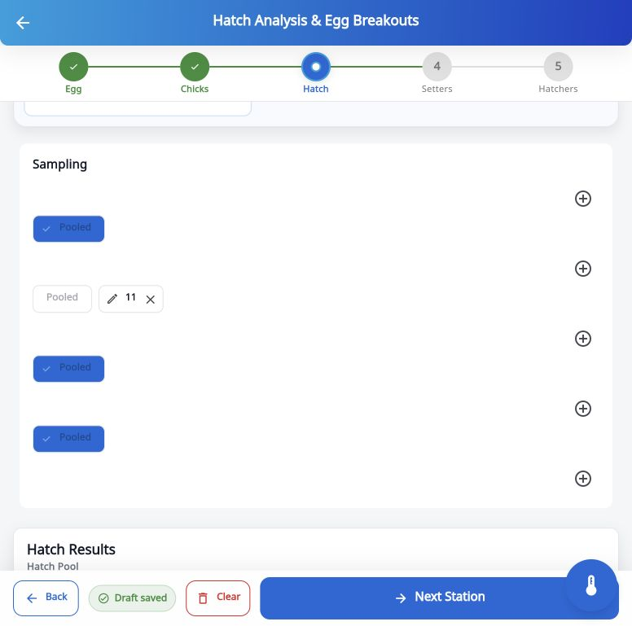
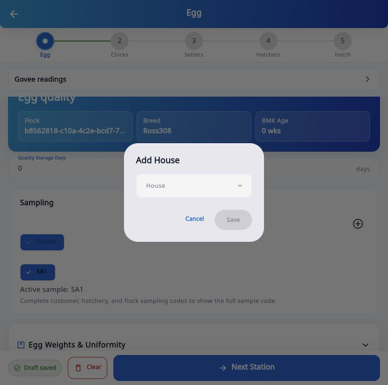
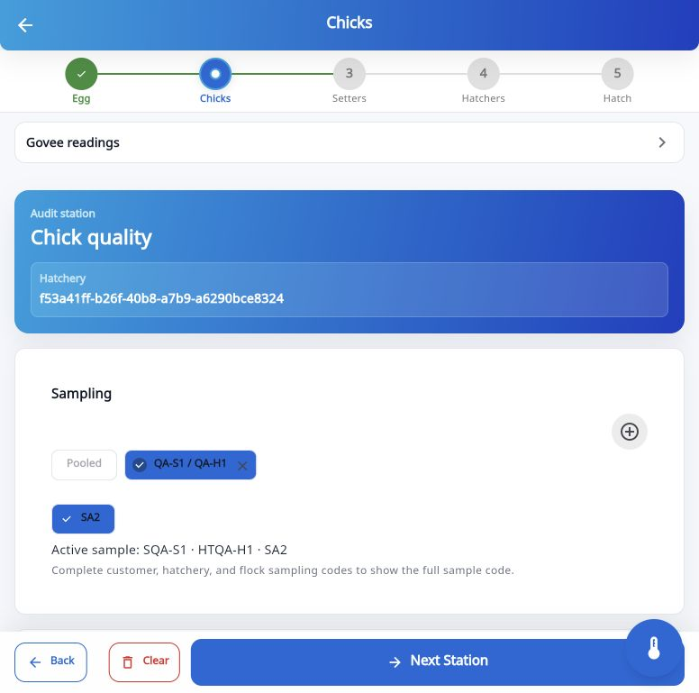
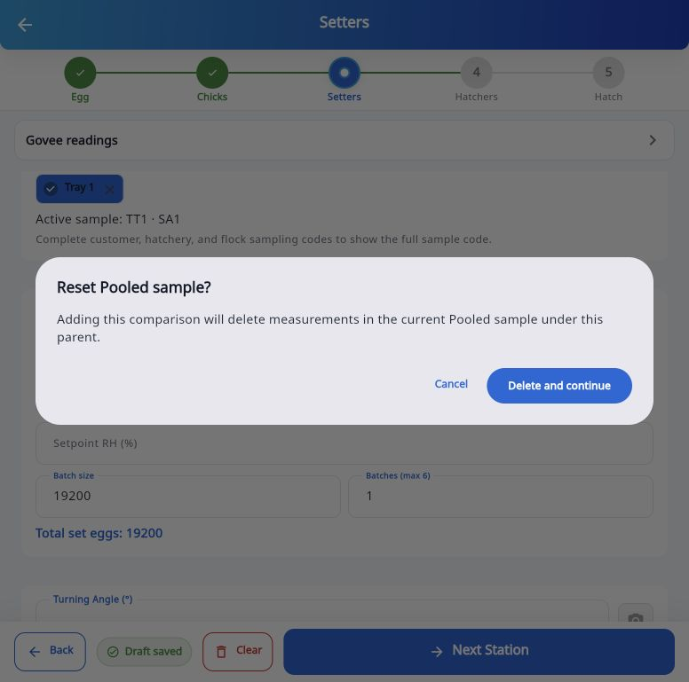
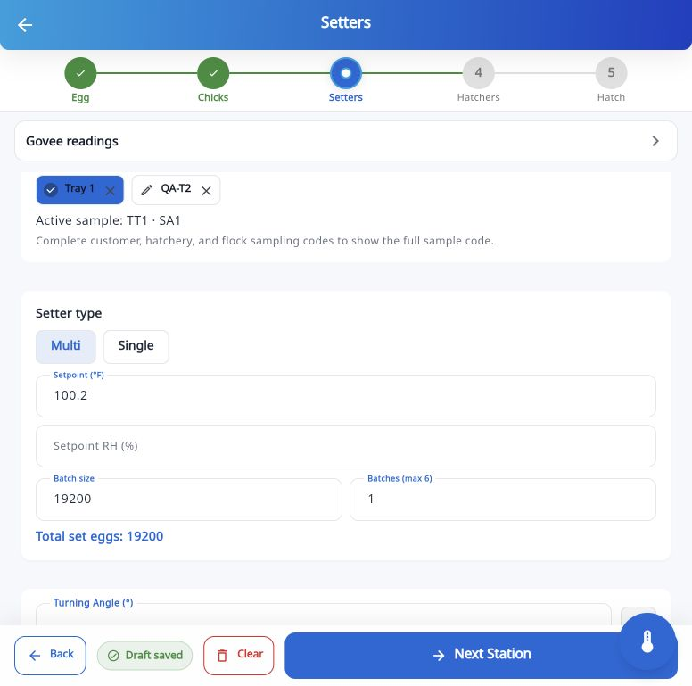
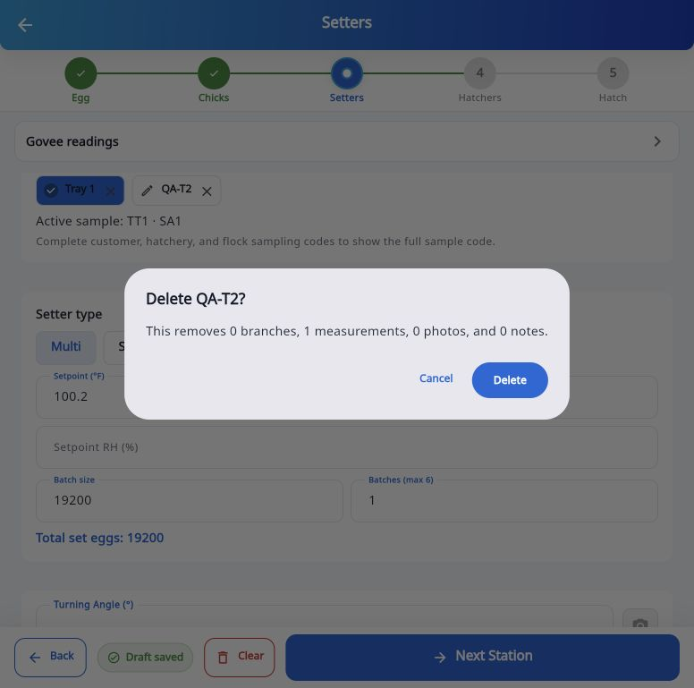
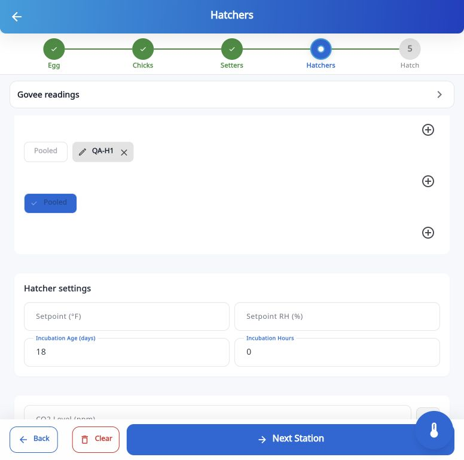
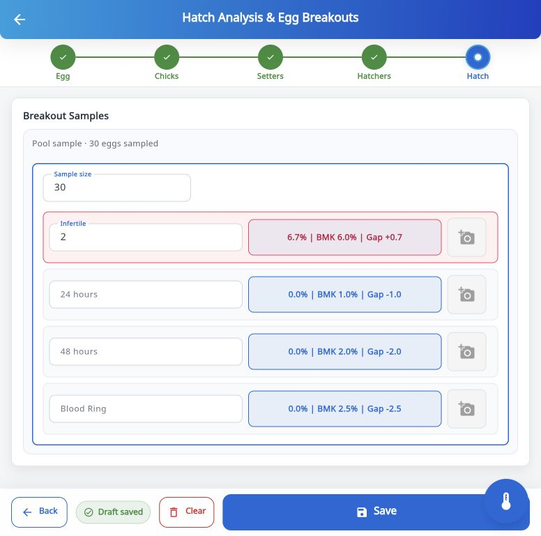
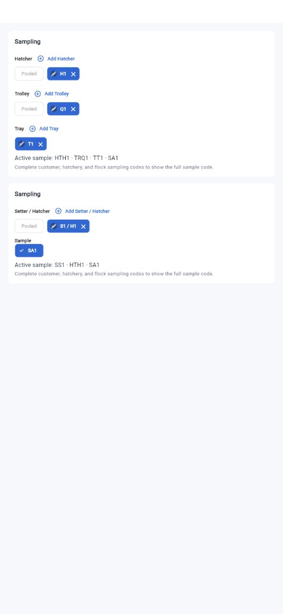
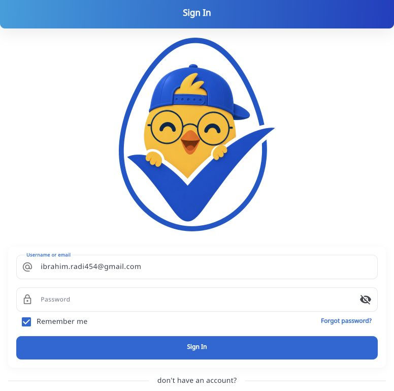

# Sampling UI and end-to-end audit — 2026-10-05

Task: sampling-ui-e2e-20261005. Current status: reviewed fixes prepared for publication; live destructive/reopen checks require user input. Human acceptance remains pending.

Scope: current published ChickMark sampling controls and live form flows; offline SQLite save/reopen and sync regressions. Browser evidence was captured in this run.

## Flow results

1. Existing sampling card — failed visual review. White scope labels disappear on white cards; selected chip text/icons have poor contrast; unlabeled + controls are ambiguous. See 01-sampling-before.jpg.
2. Independent QA visit setup — passed. Created Sampling QA 2026-10-05 hatchery and flock under Dashboard Test Customer; kept original visit intact.
3. House selector — failed empty-state review. No registered houses yields an empty disabled selector without guidance. See 03-house-empty.jpg.
4. Chick Quality pair — passed creation/selection and independent Chick Weights state. Duplicate pair is rejected but reports a generic save error. See 04-duplicate-error.jpg.
5. Measured Pooled reset — passed warning and cancellation. 99.5°F retained after cancellation. See 05-reset-warning.jpg.
6. Setter Tray switching — failed rendered field ownership. Active sample changes but controllers still display the outgoing reading. Provider/storage tests alone did not catch this. See 08-tray-switch-stale-field.jpg. Correction uses active sample identity for hydration.
7. Branch deletion — passed preview and cancellation; permanent deletion awaits specific approval. Dialog reports one affected measurement and no photos/notes. See 09-delete-confirmation.jpg.
8. Hatcher ancestor creation — failed selection/continuation. A new branch without a terminal leaf cannot become active; clicking it does nothing. See 10-hatcher-branch-no-selection.jpg. Correction creates/selects an identified default Tray below a new ancestor.
9. Fresh/Candled breakout switching — passed independent count restoration (Fresh 2/30; Candled 3/150). See 11-breakout-independent.jpg.
10. Save — passed local saved indicator. The authenticated session subsequently became available and the saved QA visit reopened. The visit reports Sync: Failed, while the global header says Synced just now; its flock lookup falls back to the UUID. After deployment 426858c, reload reproduced the same IndexedDB byte-buffer startup failure as the fixed local origin. Post-fix form checks and cloud convergence remain pending.

## Confirmed automated checks in this run

- 36 repository/adapter/save bridge/reopen tests passed.
- 47 startup push/pull and observation sync tests passed, including sampling ordering, pull-only devices, serial reconciliation failures, and tombstone resurrection guards.
- 65 Setter/Hatcher incubation, Egg, and Chick form widget tests passed (23 + 13 + 29).
- 37 Hatch breakout screen tests passed.
- Final sampling controls/House/provider run passed all 20 tests, including actual SQLite terminal identities and serial reservations.
- Localization tests passed in the combined widget run. That combined command also included a nonexistent test filename and exited with a loading error; the correct Hatch test path was then run separately and passed.
- `flutter analyze --no-pub` reports only two pre-existing `unawaited_return_in_try_block` warnings in the environment loader and photo service. No new diagnostics.
- Full app `flutter build web --release --base-href=/chickmark/ --dart-define-from-file=.env --no-pub` succeeded; standard secure-storage Wasm dry-run and font warnings remain.

## Evidence limits

These screenshots establish visible behavior, not full accessibility compliance. Phone-width rendering, readable labels, duplicate feedback, and sample ownership are covered by targeted widget checks. Real multi-device cloud convergence, photo uploads/deletions, offline network switching, and permanent branch deletion have not been exercised through the live browser in this run.

The fixed local dev origin also reproduces its prior IndexedDB byte-buffer startup error before database initialization. No browser storage was erased or alternate origin used.

## Follow-up

The bounded UI/controller fixes and focused regressions have been reviewed. Publish the verified release under standing commit/push/Pages authorization. Resume authenticated live checks after sign-in and perform destructive checks only after QA-record deletion approval. QA fixture data remains until approved cleanup.

## Captured live evidence

### 1. Original sampling controls

### 3. Empty House selector

### 4. Duplicate error

### 5. Reset protection

### 6. Stale field after switching Tray

### 7. Deletion preview

### 8. Unselected new Hatcher branch

### 9. Restored independent Fresh count

## UI review after fixes

The real SamplingScopeControls and app theme were rendered in a temporary in-memory browser harness, without authentication or SQLite. Scope text and selected icons are readable, Add buttons have explicit labels, and the paired label fits the narrow layout. The 390px widget test separately checks layout without overflow. These captures validate rendered controls, not authenticated full-app E2E. The harness was removed and the browser viewport restored.

General health: visible usability and sample-ownership defects were found and corrected. Final acceptance remains pending authenticated reopen, permanent deletion approval, photo/cloud convergence checks, and human review.

Files changed: sampling controls/provider; Setter, Hatcher, Egg and Chick screens; Arabic localization; six focused widget/provider test files; living spec, changelog and this evidence folder. No schema or remote-service change.

## Additional reload and sync findings

Pages run 37355321075 succeeded for commit 426858c. Browser reload then failed inside sqlite3 IndexedDB `readFully` while constructing a Uint8Array; the app rendered blank. The deployed dependency lock uses sqlite3 3.2.0. Upstream sqlite3 3.3.3 documents a fix that ignores obsolete blocks beyond the file length, matching the traced call. See [upstream issue 380](https://github.com/simolus3/sqlite3.dart/issues/380). Browser storage was not cleared.

The global sync header records the last sync operation; it does not establish that each visit synced. The visit's failed pill aggregates session/station row status. Exact `syncError` is stored locally and not exposed by the current Audits UI, so missing cloud schema/RPC/RLS and parent-reference errors remain hypotheses. No production migration was executed.

## Startup compatibility repair verification

Pinned only sqlite3 from 3.2.0 to 3.3.3; no other package lock changes and no schema migration. The upstream Chrome trailing-block fixture passed in isolated test storage. A further 37 actual repository/provider tests passed after the dependency update, and the full release web build succeeded. The full local app now opens its previously failing IndexedDB database at the unchanged 127.0.0.1:57863 origin and displays existing visits with no error console entries; storage was preserved.

Read-only Supabase checks confirm the three sampling tables, reconcile_panel_sample_serials RPC, and both sampling migrations exist in the configured ChickMark project. Missing migration is therefore ruled out; the precise QA visit sync error remains unconfirmed.

## Published recovery handoff

Pages run 37356455285 succeeded for startup-fix commit ab19495. The live browser initially reused the old cached bundle; navigating to the fresh entry URL `https://radi454.github.io/chickmark/?v=ab19495#/main` reached the normal Sign In screen. The latest observed error entries predate that successful fresh-entry navigation. Authenticated after-fix forms still require sign-in.

Read-only cloud queries found neither the new QA hatchery nor flock, confirming cloud convergence has not passed. The QA records remain locally and permanent deletion/cleanup still awaits approval. This task is not accepted as complete.

