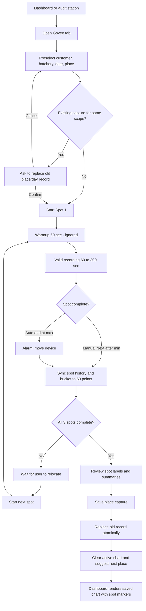
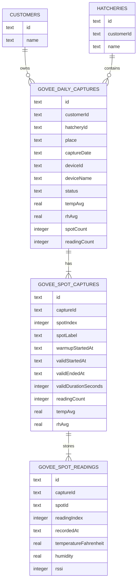
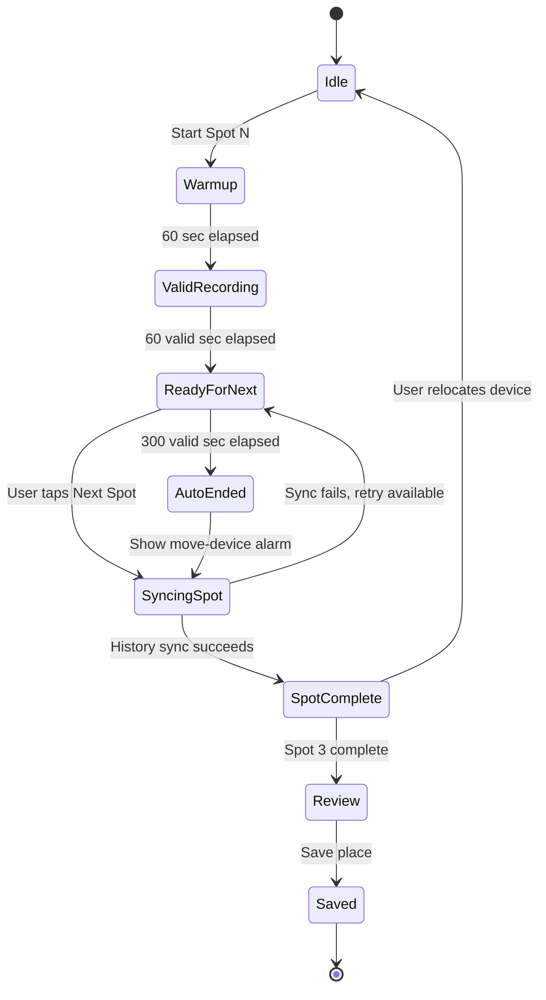

# Standalone Govee Daily Captures Implementation Plan

> **For agentic workers:** REQUIRED SUB-SKILL: Use superpowers:subagent-driven-development (recommended) or superpowers:executing-plans to implement this plan task-by-task. Steps use checkbox (`- [ ]`) syntax for tracking.

**Goal:** Replace the current Measures flow with an independent Govee capture screen that records one customer + hatchery + place + date capture with three spot segments, then exposes saved results only through dashboard views.

**Architecture:** Add a Govee-specific persistence model instead of linking environmental readings to `audit_sessions`. The Govee screen owns active capture only: it records spot windows, ignores warmup readings, syncs Govee device history, prepares 60 bucket-averaged readings per spot, and saves one place/day capture after review. Dashboard reads saved Govee captures by customer, hatchery, place, and capture date; audit station screens only deep-link into the Govee screen with preselected context.

**Tech Stack:** Flutter, Provider, sqflite, flutter_blue_plus, fl_chart, mocktail, flutter_test.

---

## Decisions Captured

- Govee data is independent from audit sessions and must not use `auditSessionId`.
- The user-facing link is customer name + hatchery name; storage uses stable `customerId` + `hatcheryId`.
- Every saved capture is scoped by `customerId + hatcheryId + place + captureDate`.
- `captureDate` defaults to today's calendar date and is the day label used for comparison.
- There is one saved record per place/date. Re-recording the same place/date asks whether to replace old records.
- Old records remain available until the replacement recording saves successfully.
- Old audit-linked temperature records are deleted during migration.
- Govee replaces the Measures tab.
- Govee screen is for active recording only. Saved charts are not browsed there.
- Dashboard is the place to view saved Govee charts and summaries.
- Audit station screens show a `Govee readings` button, not the live Govee card.
- Opening Govee from an audit station preselects customer, hatchery, and place, but the user can change the place before recording.
- Default place flow is Egg storage room -> Chick holding area -> Incubator room -> Hatcher room.
- After saving a place, the chart clears and the screen suggests the next place. After the last place, it shows a neutral choose-next-place state.
- Each place has exactly three fixed spots.
- Each spot has 60 seconds warmup that is ignored and never saved.
- Each spot then requires at least 60 seconds valid data and allows at most 300 seconds valid data.
- If a spot reaches 300 valid seconds, the app auto-ends that spot and prompts the user to relocate the device.
- The next spot warmup starts only after the user taps `Start Spot N` after relocating the device.
- The user cannot manually advance before warmup + 60 seconds valid data are complete.
- Each spot is saved as up to 60 bucket-averaged readings from synced Govee device history.
- The review screen allows editing spot labels only. Defaults are `Spot 1`, `Spot 2`, `Spot 3`.
- Dashboard chart shows one combined place chart with vertical markers between spots and per-spot summary chips.

## Diagrams

### Product Flow



### Data Model



### Spot State Machine



---

## File Structure

### New Files

- `lib/data/models/govee_capture_model.dart`: immutable daily capture, spot capture, and spot reading models.
- `lib/data/repositories/govee_capture_repository.dart`: transactional save/replace and dashboard query API for Govee captures.
- `lib/features/govee/providers/govee_capture_provider.dart`: active recording state machine, spot timers, Govee history sync, bucket averaging, replacement confirmation state, next-place progression.
- `lib/features/govee/screens/govee_screen.dart`: renamed Measures tab screen, active-only Govee capture UI.
- `lib/features/govee/widgets/govee_scope_picker.dart`: customer, hatchery, capture date, and place controls.
- `lib/features/govee/widgets/govee_spot_recorder.dart`: current spot warmup/valid timer, chart preview, next-spot button, max-duration alarm.
- `lib/features/govee/widgets/govee_review_sheet.dart`: three-spot review with editable spot labels and save action.
- `lib/features/dashboard/models/govee_capture_summary.dart`: dashboard-ready combined chart and per-spot summary model.
- `lib/features/dashboard/widgets/govee_capture_chart.dart`: combined place chart with vertical spot markers.
- `test/data/models/govee_capture_model_test.dart`: model serialization tests.
- `test/data/repositories/govee_capture_repository_test.dart`: replacement and query tests.
- `test/features/govee/govee_capture_provider_test.dart`: spot timing, warmup exclusion, bucket averaging, replacement behavior.
- `test/features/govee/govee_screen_test.dart`: UI state and review behavior tests.
- `test/features/dashboard/govee_capture_chart_test.dart`: chart marker rendering smoke tests.

### Modified Files

- `lib/data/database/database_helper.dart`: add schema version 22, Govee tables, indexes, migration cleanup for old audit-linked temperature rows.
- `lib/services/supabase/startup_sync_service.dart`: sync new Govee tables instead of treating audit-linked temperature sessions as evidence.
- `lib/services/supabase/supabase_service.dart`: add pull/upsert support for Govee tables if remote sync is enabled for those tables.
- `lib/app.dart`: register `GoveeCaptureProvider`; remove or stop showing the global Measures launcher if the product no longer needs a floating recorder.
- `lib/core/constants/app_strings.dart`: rename `temperatureTab` from `Measures` to `Govee`.
- `lib/features/home/widgets/main_shell.dart`: point the tab at `GoveeScreen`.
- `lib/features/audits/screens/audit_session_screen.dart`: replace `GoveeRecordingCard` with `Govee readings` button.
- `lib/features/audits/widgets/govee_recording_card.dart`: delete after references are removed.
- `lib/features/audits/utils/audit_govee_spots.dart`: keep station-to-place mapping; move to `lib/features/govee/utils/govee_place_flow.dart` if reused outside audits.
- `lib/features/dashboard/providers/dashboard_provider.dart`: load dashboard Govee captures by customer/hatchery/date.
- `lib/features/dashboard/screens/dashboard_screen.dart`: replace session temperature chips with Govee dashboard summaries.
- `lib/features/customers/screens/customer_detail_screen.dart`: stop showing old audit-linked temperature chips.
- `lib/features/customers/screens/visit_detail_screen.dart`: show dashboard-linked Govee summaries by visit date instead of audit-linked temperature summaries.
- `docs/LIVING_SPEC.md`: document standalone Govee behavior.

---

## Task 1: Model and Schema Tests

**Files:**
- Create: `test/data/models/govee_capture_model_test.dart`
- Create: `test/data/repositories/govee_capture_repository_test.dart`
- Modify: `test/data/database/database_helper_migration_test.dart`

- [ ] **Step 1: Write model serialization tests**

Add tests that assert daily capture, spot capture, and spot reading rows round-trip through `toMap()` and `fromMap()`.

```dart
test('daily capture round-trips capture scope and summaries', () {
  final now = DateTime.parse('2026-05-02T10:00:00');
  final capture = GoveeDailyCaptureModel(
    id: 'capture-1',
    customerId: 'customer-1',
    hatcheryId: 'hatchery-1',
    place: TemperaturePlace.eggStorageRoom,
    captureDate: '2026-05-02',
    deviceId: 'device-1',
    deviceName: 'Govee H5051',
    status: 'completed',
    tempAvg: 72.5,
    tempMin: 71.0,
    tempMax: 74.0,
    rhAvg: 57.1,
    rhMin: 55.0,
    rhMax: 59.0,
    spotCount: 3,
    readingCount: 180,
    createdAt: now,
    updatedAt: now,
  );

  final restored = GoveeDailyCaptureModel.fromMap(capture.toMap());

  expect(restored.id, 'capture-1');
  expect(restored.customerId, 'customer-1');
  expect(restored.hatcheryId, 'hatchery-1');
  expect(restored.place, TemperaturePlace.eggStorageRoom);
  expect(restored.captureDate, '2026-05-02');
  expect(restored.spotCount, 3);
  expect(restored.readingCount, 180);
});
```

- [ ] **Step 2: Write repository replacement tests**

Create tests proving there is only one saved record per `customerId + hatcheryId + place + captureDate` and replacement deletes the old spot/readings in the same transaction.

```dart
test('saveReplacement replaces existing capture for same scope atomically', () async {
  final repo = GoveeCaptureRepository(dbHelper: dbHelper);

  await repo.saveReplacement(
    capture: oldCapture,
    spots: oldSpots,
    readings: oldReadings,
  );
  await repo.saveReplacement(
    capture: newCapture,
    spots: newSpots,
    readings: newReadings,
  );

  final captures = await repo.getCapturesForScope(
    customerId: 'customer-1',
    hatcheryId: 'hatchery-1',
    place: TemperaturePlace.eggStorageRoom,
    captureDate: '2026-05-02',
  );

  expect(captures, hasLength(1));
  expect(captures.single.id, newCapture.id);
  expect(await repo.getSpotReadings(newSpots.first.id), hasLength(60));
});
```

- [ ] **Step 3: Write migration cleanup test**

Add a migration test that seeds audit-linked `temperature_sessions` and verifies upgrade to version 22 deletes those rows and their readings.

```dart
expect(
  executedSql.join('\n'),
  contains('DELETE FROM temperature_readings WHERE sessionId IN'),
);
expect(
  executedSql.join('\n'),
  contains('DELETE FROM temperature_sessions WHERE auditSessionId IS NOT NULL'),
);
```

- [ ] **Step 4: Run failing tests**

Run: `flutter test test/data/models/govee_capture_model_test.dart test/data/repositories/govee_capture_repository_test.dart test/data/database/database_helper_migration_test.dart`

Expected: FAIL because `GoveeDailyCaptureModel`, `GoveeCaptureRepository`, and version 22 migration do not exist yet.

---

## Task 2: Govee Tables, Models, and Repository

**Files:**
- Create: `lib/data/models/govee_capture_model.dart`
- Create: `lib/data/repositories/govee_capture_repository.dart`
- Modify: `lib/data/database/database_helper.dart`

- [ ] **Step 1: Add database tables and migration**

Increase database version from `21` to `22`. Add `_createGoveeCaptureTables(db)` and call it from `_onCreate` and `_onUpgrade` when `oldVersion < 22`.

```dart
await db.execute('''CREATE TABLE IF NOT EXISTS govee_daily_captures (
  id TEXT PRIMARY KEY,
  customerId TEXT NOT NULL,
  hatcheryId TEXT NOT NULL,
  place TEXT NOT NULL,
  captureDate TEXT NOT NULL,
  deviceId TEXT,
  deviceName TEXT,
  status TEXT NOT NULL,
  tempAvg REAL,
  tempMin REAL,
  tempMax REAL,
  rhAvg REAL,
  rhMin REAL,
  rhMax REAL,
  spotCount INTEGER NOT NULL,
  readingCount INTEGER NOT NULL,
  createdAt TEXT NOT NULL,
  updatedAt TEXT NOT NULL,
  UNIQUE(customerId, hatcheryId, place, captureDate)
)''');

await db.execute('''CREATE TABLE IF NOT EXISTS govee_spot_captures (
  id TEXT PRIMARY KEY,
  captureId TEXT NOT NULL,
  spotIndex INTEGER NOT NULL,
  spotLabel TEXT NOT NULL,
  warmupStartedAt TEXT NOT NULL,
  validStartedAt TEXT NOT NULL,
  validEndedAt TEXT NOT NULL,
  validDurationSeconds INTEGER NOT NULL,
  tempAvg REAL,
  tempMin REAL,
  tempMax REAL,
  rhAvg REAL,
  rhMin REAL,
  rhMax REAL,
  readingCount INTEGER NOT NULL,
  createdAt TEXT NOT NULL,
  updatedAt TEXT NOT NULL,
  FOREIGN KEY (captureId) REFERENCES govee_daily_captures(id) ON DELETE CASCADE
)''');

await db.execute('''CREATE TABLE IF NOT EXISTS govee_spot_readings (
  id TEXT PRIMARY KEY,
  captureId TEXT NOT NULL,
  spotId TEXT NOT NULL,
  readingIndex INTEGER NOT NULL,
  recordedAt TEXT NOT NULL,
  temperatureFahrenheit REAL NOT NULL,
  humidity REAL NOT NULL,
  rssi INTEGER,
  deviceName TEXT,
  createdAt TEXT NOT NULL,
  FOREIGN KEY (captureId) REFERENCES govee_daily_captures(id) ON DELETE CASCADE,
  FOREIGN KEY (spotId) REFERENCES govee_spot_captures(id) ON DELETE CASCADE
)''');
```

Create indexes:

```dart
await db.execute(
  'CREATE INDEX IF NOT EXISTS idx_govee_daily_scope ON govee_daily_captures (customerId, hatcheryId, place, captureDate)',
);
await db.execute(
  'CREATE INDEX IF NOT EXISTS idx_govee_spots_capture ON govee_spot_captures (captureId, spotIndex)',
);
await db.execute(
  'CREATE INDEX IF NOT EXISTS idx_govee_readings_spot ON govee_spot_readings (spotId, readingIndex)',
);
```

Delete old audit-linked temperature evidence during migration:

```dart
await db.execute('''
DELETE FROM temperature_readings
WHERE sessionId IN (
  SELECT id FROM temperature_sessions
  WHERE auditSessionId IS NOT NULL
)
''');
await db.execute(
  'DELETE FROM temperature_sessions WHERE auditSessionId IS NOT NULL',
);
```

- [ ] **Step 2: Add model classes**

Create `GoveeDailyCaptureModel`, `GoveeSpotCaptureModel`, and `GoveeSpotReadingModel` with `fromMap`, `toMap`, and `copyWith`. Use `TemperaturePlace` from `temperature_rh_model.dart` to avoid duplicating place enums.

- [ ] **Step 3: Add repository API**

Implement these methods:

```dart
Future<GoveeDailyCaptureModel?> getCaptureForScope({
  required String customerId,
  required String hatcheryId,
  required TemperaturePlace place,
  required String captureDate,
});

Future<void> saveReplacement({
  required GoveeDailyCaptureModel capture,
  required List<GoveeSpotCaptureModel> spots,
  required List<GoveeSpotReadingModel> readings,
});

Future<List<GoveeDailyCaptureModel>> getCapturesForDashboard({
  required String customerId,
  required String hatcheryId,
  String? captureDate,
});

Future<List<GoveeSpotCaptureModel>> getSpotsForCapture(String captureId);

Future<List<GoveeSpotReadingModel>> getReadingsForCapture(String captureId);
```

`saveReplacement` must run in one transaction:

```dart
await db.transaction((txn) async {
  final existing = await txn.query(
    'govee_daily_captures',
    where: 'customerId = ? AND hatcheryId = ? AND place = ? AND captureDate = ?',
    whereArgs: [
      capture.customerId,
      capture.hatcheryId,
      capture.place.name,
      capture.captureDate,
    ],
    limit: 1,
  );
  for (final row in existing) {
    await txn.delete(
      'govee_daily_captures',
      where: 'id = ?',
      whereArgs: [row['id']],
    );
  }
  await txn.insert('govee_daily_captures', capture.toMap());
  for (final spot in spots) {
    await txn.insert('govee_spot_captures', spot.toMap());
  }
  for (final reading in readings) {
    await txn.insert('govee_spot_readings', reading.toMap());
  }
});
```

- [ ] **Step 4: Run model/repository tests**

Run: `flutter test test/data/models/govee_capture_model_test.dart test/data/repositories/govee_capture_repository_test.dart test/data/database/database_helper_migration_test.dart`

Expected: PASS.

---

## Task 3: Govee Provider State Machine

**Files:**
- Create: `lib/features/govee/providers/govee_capture_provider.dart`
- Create: `lib/features/govee/utils/govee_place_flow.dart`
- Create: `test/features/govee/govee_capture_provider_test.dart`

- [ ] **Step 1: Write provider tests for spot timing**

Test that a spot cannot finish before 60 seconds warmup + 60 seconds valid data, can finish after the minimum, and auto-ends after 300 valid seconds.

```dart
test('spot cannot finish before warmup plus minimum valid window', () async {
  final provider = GoveeCaptureProvider(
    repository: mockRepo,
    goveeService: mockGovee,
    clock: fakeClock,
  );

  provider.configure(
    customerId: 'customer-1',
    hatcheryId: 'hatchery-1',
    place: TemperaturePlace.eggStorageRoom,
    captureDate: '2026-05-02',
  );
  await provider.startCurrentSpot();
  fakeClock.elapse(const Duration(seconds: 119));

  expect(provider.canFinishCurrentSpot, isFalse);

  fakeClock.elapse(const Duration(seconds: 1));

  expect(provider.canFinishCurrentSpot, isTrue);
});
```

- [ ] **Step 2: Write provider tests for bucket averaging**

Use 300 synced readings and verify the provider returns exactly 60 readings with averaged values.

```dart
test('bucket averaging compresses synced spot history to 60 readings', () {
  final readings = List.generate(300, (index) {
    return GoveeSensorReading(
      temperatureFahrenheit: 70 + (index / 100),
      humidity: 55 + (index / 200),
      timestamp: DateTime.parse('2026-05-02T10:00:00').add(
        Duration(seconds: index),
      ),
    );
  });

  final compressed = GoveeCaptureProvider.compressSyncedReadings(
    readings,
    targetCount: 60,
  );

  expect(compressed, hasLength(60));
  expect(compressed.first.temperatureFahrenheit, closeTo(70.02, 0.05));
});
```

- [ ] **Step 3: Implement provider state**

Add these public fields and methods:

```dart
static const int spotCount = 3;
static const Duration warmupDuration = Duration(seconds: 60);
static const Duration minimumValidDuration = Duration(seconds: 60);
static const Duration maximumValidDuration = Duration(minutes: 5);

Future<void> configure({
  required String customerId,
  required String hatcheryId,
  required TemperaturePlace place,
  String? captureDate,
});

Future<void> startCurrentSpot();
Future<void> finishCurrentSpot();
Future<void> savePlaceCapture({required List<String> spotLabels});
void clearAfterSaveAndSuggestNextPlace();
```

Represent phases with an enum:

```dart
enum GoveeSpotPhase {
  idle,
  warmup,
  validRecording,
  readyForNext,
  autoEnded,
  syncing,
  complete,
  review,
  saving,
  saved,
}
```

- [ ] **Step 4: Sync official data per spot**

On `finishCurrentSpot`, call:

```dart
final validStartedAt = warmupStartedAt.add(warmupDuration);
final synced = await _goveeService.syncHistory(
  startedAt: validStartedAt,
  endedAt: validEndedAt,
);
final valid = _filterValidSyncedReadings(synced, validStartedAt, validEndedAt);
if (valid.length < 60) {
  _error = 'Not enough synced Govee readings for this spot';
  _phase = GoveeSpotPhase.readyForNext;
  notifyListeners();
  return;
}
final compressed = compressSyncedReadings(valid, targetCount: 60);
```

Do not persist anything during spot completion. Keep pending spot data in memory until `savePlaceCapture`.

- [ ] **Step 5: Save one place/day capture**

Build one `GoveeDailyCaptureModel`, three `GoveeSpotCaptureModel` rows, and 180 `GoveeSpotReadingModel` rows. Call `repository.saveReplacement(...)`. This keeps the old record until the new one saves successfully.

- [ ] **Step 6: Run provider tests**

Run: `flutter test test/features/govee/govee_capture_provider_test.dart`

Expected: PASS.

---

## Task 4: Replace Measures UI with Govee Capture UI

**Files:**
- Create: `lib/features/govee/screens/govee_screen.dart`
- Create: `lib/features/govee/widgets/govee_scope_picker.dart`
- Create: `lib/features/govee/widgets/govee_spot_recorder.dart`
- Create: `lib/features/govee/widgets/govee_review_sheet.dart`
- Create: `test/features/govee/govee_screen_test.dart`
- Modify: `lib/app.dart`
- Modify: `lib/core/constants/app_strings.dart`
- Modify: `lib/features/home/widgets/main_shell.dart`

- [ ] **Step 1: Write Govee screen widget tests**

Test the main UI states:

```dart
testWidgets('Govee screen shows capture controls instead of saved history', (tester) async {
  await tester.pumpWidget(buildGoveeTestApp());

  expect(find.text('Govee'), findsOneWidget);
  expect(find.text('Start Spot 1'), findsOneWidget);
  expect(find.text('No measures yet'), findsNothing);
});
```

Test review label editing:

```dart
testWidgets('review allows editing spot labels only', (tester) async {
  await tester.pumpWidget(buildCompletedGoveeCaptureApp());

  expect(find.text('Spot 1'), findsOneWidget);
  await tester.enterText(find.byKey(const ValueKey('govee-spot-label-1')), 'Door');

  expect(find.text('Customer'), findsNothing);
  expect(find.text('Hatchery'), findsNothing);
});
```

- [ ] **Step 2: Rename tab label**

Change:

```dart
static const String temperatureTab = 'Measures';
```

to:

```dart
static const String temperatureTab = 'Govee';
```

- [ ] **Step 3: Register provider**

In `lib/app.dart`, add:

```dart
ChangeNotifierProvider(create: (_) => GoveeCaptureProvider()),
```

Keep `TemperatureRhProvider` only if another screen still references it after this task. Remove the floating `_AppMeasureOverlay` launcher if the Govee recording flow must only live in the tab and audit/dashboard links.

- [ ] **Step 4: Swap the tab screen**

In `lib/features/home/widgets/main_shell.dart`, replace:

```dart
import '../../temperature/screens/temperature_rh_screen.dart';
```

with:

```dart
import '../../govee/screens/govee_screen.dart';
```

and replace the tab builder result:

```dart
return const TemperatureRhScreen();
```

with:

```dart
return const GoveeScreen();
```

- [ ] **Step 5: Build active-only Govee screen**

`GoveeScreen` should show:

- Customer selector.
- Hatchery selector scoped to selected customer.
- Date selector defaulting to today.
- Place selector using Egg storage room, Chick holding area, Incubator room, Hatcher room.
- Existing-record warning before start when a saved capture exists for the selected scope.
- Current spot recorder.
- Temporary chart that clears after save.
- Review sheet after Spot 3.

Saved history lists must not appear on this screen.

- [ ] **Step 6: Run UI tests**

Run: `flutter test test/features/govee/govee_screen_test.dart`

Expected: PASS.

---

## Task 5: Audit Station Govee Entry Point

**Files:**
- Modify: `lib/features/audits/screens/audit_session_screen.dart`
- Modify: `lib/features/audits/utils/audit_govee_spots.dart`
- Delete after references are gone: `lib/features/audits/widgets/govee_recording_card.dart`
- Modify: `test/features/audits/audit_govee_spots_test.dart`
- Modify: `test/features/audits/audit_session_navigation_test.dart`

- [ ] **Step 1: Write test for audit button**

Test that supported room stations show `Govee readings`, and unsupported stations do not.

```dart
expect(find.text('Govee readings'), findsOneWidget);
expect(find.byType(GoveeRecordingCard), findsNothing);
```

- [ ] **Step 2: Replace `GoveeRecordingCard`**

Remove `_buildCurrentStationGoveeCard` content that mounts `GoveeRecordingCard`. Replace it with a compact button:

```dart
TextButton.icon(
  key: const ValueKey('audit-open-govee-readings'),
  onPressed: () {
    final spot = goveeSpotForStationKey(stationKey);
    if (spot == null) return;
    context.read<GoveeCaptureProvider>().configure(
      customerId: session.customerId,
      hatcheryId: session.hatcheryId,
      place: spot.place,
    );
    ShellNavigationScope.maybeOf(context)?.switchTab(4);
  },
  icon: const Icon(Icons.device_thermostat_outlined),
  label: const Text('Govee readings'),
);
```

If `ShellNavigationScope` is not available in this navigation depth, push `GoveeScreen` with an initial context object instead of switching tabs.

- [ ] **Step 3: Delete obsolete widget**

Delete `lib/features/audits/widgets/govee_recording_card.dart` only after `rg "GoveeRecordingCard" lib test` returns no references.

- [ ] **Step 4: Run audit tests**

Run: `flutter test test/features/audits/audit_govee_spots_test.dart test/features/audits/audit_session_navigation_test.dart`

Expected: PASS.

---

## Task 6: Dashboard Govee Summaries and Chart

**Files:**
- Create: `lib/features/dashboard/models/govee_capture_summary.dart`
- Create: `lib/features/dashboard/widgets/govee_capture_chart.dart`
- Create: `test/features/dashboard/govee_capture_chart_test.dart`
- Modify: `lib/features/dashboard/providers/dashboard_provider.dart`
- Modify: `lib/features/dashboard/screens/dashboard_screen.dart`
- Modify: `lib/features/customers/screens/customer_detail_screen.dart`
- Modify: `lib/features/customers/screens/visit_detail_screen.dart`
- Modify: `test/features/dashboard/visit_dashboard_test.dart`

- [ ] **Step 1: Write dashboard provider test**

Test dashboard loads Govee captures for selected customer/hatchery and selected visit date.

```dart
test('loads Govee captures by customer hatchery and visit date', () async {
  when(
    () => mockGoveeRepo.getCapturesForDashboard(
      customerId: 'customer-1',
      hatcheryId: 'hatchery-1',
      captureDate: '2026-05-02',
    ),
  ).thenAnswer((_) async => [capture]);

  provider.selectVisitSession(visitForDate('2026-05-02'));

  expect(provider.goveeCaptures, hasLength(1));
});
```

- [ ] **Step 2: Add dashboard model**

`GoveeCaptureSummary` should expose:

```dart
final GoveeDailyCaptureModel capture;
final List<GoveeSpotCaptureModel> spots;
final List<GoveeSpotReadingModel> readings;
List<GoveeChartPoint> get combinedTempPoints;
List<int> get spotBoundaryIndexes;
```

`spotBoundaryIndexes` should be `[60, 120]` when all three spots have 60 readings.

- [ ] **Step 3: Add chart widget**

`GoveeCaptureChart` should render one combined chart. Use vertical line markers at spot boundaries and label the segments with the final spot labels.

```dart
LineChartBarData(
  spots: summary.combinedTempPoints
      .map((p) => FlSpot(p.x.toDouble(), p.temperatureFahrenheit))
      .toList(),
  isCurved: true,
  dotData: FlDotData(show: false),
);
```

Use `ExtraLinesData` or overlay positioned dividers for boundary markers, depending on which approach is simplest with the current `fl_chart` version.

- [ ] **Step 4: Replace old temperature summary chips**

Remove dashboard dependency on `VisitSessionSummary.temperatureSummaries` for Govee display. Show Govee captures by selected visit date, not by audit session link.

The dashboard section should show:

- Place label.
- Capture date.
- Temp/RH averages.
- `3 spots`.
- `180 readings` when all spots are complete.
- Combined chart with Spot 1/2/3 markers.

- [ ] **Step 5: Run dashboard tests**

Run: `flutter test test/features/dashboard/visit_dashboard_test.dart test/features/dashboard/govee_capture_chart_test.dart`

Expected: PASS.

---

## Task 7: Sync Integration

**Files:**
- Modify: `lib/services/supabase/startup_sync_service.dart`
- Modify: `lib/services/supabase/supabase_service.dart`
- Create or modify tests for Supabase sync if this repo has existing sync tests.

- [ ] **Step 1: Add repository to startup sync**

Add:

```dart
final GoveeCaptureRepository _goveeCaptureRepository = GoveeCaptureRepository();
```

- [ ] **Step 2: Push Govee tables**

Upload rows in dependency order:

```dart
progress(0.64, 'Uploading Govee captures');
final captures = await _goveeCaptureRepository.getAllCaptures();
await _supabaseService.upsertRows(
  'govee_daily_captures',
  captures.map((capture) => capture.toMap()).toList(),
);
final spots = await _goveeCaptureRepository.getAllSpots();
await _supabaseService.upsertRows(
  'govee_spot_captures',
  spots.map((spot) => spot.toMap()).toList(),
);
final readings = await _goveeCaptureRepository.getAllReadings();
await _supabaseService.upsertRows(
  'govee_spot_readings',
  readings.map((reading) => reading.toMap()).toList(),
);
```

- [ ] **Step 3: Pull Govee tables**

Extend `pullFromSupabase` callbacks with:

```dart
upsertGoveeDailyCapture: (row) =>
    _goveeCaptureRepository.upsertCaptureRow(row),
upsertGoveeSpotCapture: (row) =>
    _goveeCaptureRepository.upsertSpotRow(row),
upsertGoveeSpotReading: (row) =>
    _goveeCaptureRepository.upsertReadingRow(row),
```

- [ ] **Step 4: Verify old temperature sync remains safe**

Keep `temperature_sessions` and `temperature_readings` sync only for any remaining legacy non-audit records. The new Govee UI and dashboard must not query audit-linked temperature rows.

---

## Task 8: Documentation and Verification

**Files:**
- Modify: `docs/LIVING_SPEC.md`

- [ ] **Step 1: Update living spec**

Document:

- Measures tab is now Govee.
- Govee is independent from audit sessions.
- Govee captures are keyed by customer, hatchery, place, and capture date.
- One place/date capture has three spots.
- Each spot ignores 60 seconds warmup.
- Each spot saves 60 bucket-averaged synced readings from valid Govee history.
- Re-recording a same place/date replaces old records only after the new save succeeds.
- Dashboard renders saved Govee results with spot markers.
- Old audit-linked temperature evidence is deleted during migration.

- [ ] **Step 2: Run focused verification**

Run:

```bash
flutter test test/data/models/govee_capture_model_test.dart test/data/repositories/govee_capture_repository_test.dart test/features/govee/govee_capture_provider_test.dart test/features/govee/govee_screen_test.dart test/features/audits/audit_govee_spots_test.dart test/features/audits/audit_session_navigation_test.dart test/features/dashboard/visit_dashboard_test.dart test/features/dashboard/govee_capture_chart_test.dart test/data/database/database_helper_migration_test.dart
```

Expected: PASS.

- [ ] **Step 3: Run static analysis**

Run:

```bash
flutter analyze
```

Expected: no new issues.

- [ ] **Step 4: Manual web smoke test**

Run:

```bash
RESTART=1 make run-web
```

Open `http://127.0.0.1:57863` and verify:

- The tab says Govee.
- The old Measures saved-history list is gone.
- Govee can be configured with customer, hatchery, date, and place.
- Spot 1 requires warmup before valid recording.
- Manual next is disabled before the minimum valid window.
- Max valid duration auto-ends a spot and prompts relocation.
- Review shows three editable spot labels.
- Save clears the active chart and suggests the next place.
- Dashboard shows the saved place/day chart with spot markers.

---

## Self-Review

- Spec coverage: every user decision from the grill is mapped to a task above.
- Placeholder scan: no task relies on undefined planned behavior; all uncertain implementation details have a chosen path.
- Type consistency: model, repository, provider, and dashboard names are consistent across tasks.

