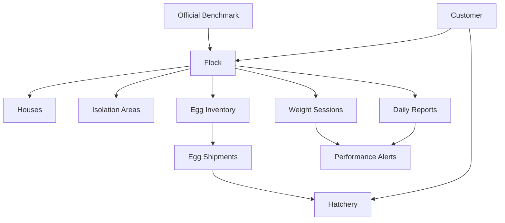

# Breeder Flock Performance Design

Date: 2026-08-27

Status: Approved in conversation; awaiting written-spec review

Scope: Replace the existing Broiler Performance area with complete Breeder Flock Performance management.

## 1. Purpose

ChickMark will manage a breeder flock from placement at day one through final depletion. The feature will connect each customer to its flocks and each flock to its houses, daily operational reports, official performance benchmarks, egg inventory, and hatchery shipments.

This is a full replacement, not a rename of the current Broiler feature. The implementation must remove all obsolete Broiler, Farm, farm-visit, investigation, and corrective-action code within this feature. No compatibility layer or unused placeholder code will remain.

Hatchery results are explicitly out of scope for this phase. Egg dispatch to a hatchery remains in scope so that later hatchery-result integration can use clean historical shipment data.

## 2. Approved business hierarchy

There is no Farm entity or placement layer in the target model. A flock owns its houses directly. `flocks.entryDate` is the single placement date because all houses in a flock are populated on the same day.

## 3. Lifecycle and age

The feature covers:

- rearing;
- pre-production;
- production;
- partial depletion; and
- final depletion.

`breeder_flock_milestones` records operational events such as grading, physical transfer, light stimulation, first egg, 5% production, 50% production, peak production, partial depletion, start of depletion, and final depletion.

Depletion is never forced at 65 weeks or any other fixed age. The official guide age is a reference only. Actual partial and final depletion events control the flock state.

Total age is calculated from `flocks.entryDate`. Production week is not based on a manually entered production-start date, physical transfer, or first egg. It is obtained from the official benchmark profile for the flock's breed and version. For example, the Ross 308 Parent Stock objectives map flock age 25 weeks to production week 1 and flock age 34 weeks to production week 10. Other official profiles may provide a different mapping.

Before the official production range begins, the production-week field is empty and the flock is displayed as pre-production.

## 4. Official benchmarks

Benchmarks are versioned database data, not constants in application code. Only official breed-company values are supported. Customers cannot override or edit them.

### 4.1 Tables

`breeder_metric_definitions` defines the stable metric code, label, unit, sex scope, period type, aggregation method, and display precision.

`breeder_benchmark_profiles` identifies the company, breed, product/variant, official guide version, publication date, source URL, effective range, lifecycle coverage, and state (`draft`, `active`, or `archived`). Published versions are immutable.

`breeder_benchmark_values` stores one official value for a profile, metric, age, and applicable sex. It supports:

- `ageDays`;
- `ageWeek`;
- `productionWeek` when officially provided;
- `periodType` (`daily`, `weekly`, or `cumulative`);
- target value;
- official lower and upper values only when the source provides them; and
- unit inherited from the metric definition.

The database must support at least these official metrics when supplied by the source:

- female and male body weight;
- uniformity and coefficient of variation;
- daily and cumulative feed per bird;
- water and water-to-feed ratio;
- male-to-female ratio;
- mortality, culls, and livability;
- age at production milestones;
- total eggs;
- hen-day and hen-housed production;
- settable or hatching eggs;
- reject, floor, dirty, cracked, small, and oversized eggs;
- egg weight;
- fertility;
- hatch of all eggs and hatch of fertile eggs;
- weekly and cumulative chicks; and
- numeric chick-quality targets when an official source supplies them.

Each comparison records the benchmark profile version used so later official releases do not rewrite historical interpretation.

### 4.2 Sources

Initial benchmark data must be transcribed and verified against primary official publications, including:

- [Aviagen Ross 308 Parent Stock Performance Objectives](https://ross-na.aviagen.com/assets/Tech_Center/Ross_PS/Ross308-ParentStock-PerformanceObjectives-2021-EN.pdf)
- [Aviagen Ross Parent Stock Production Pocket Guide](https://aa-intl.aviagen.com/assets/Tech_Center/Ross_PS/Ross_PS_PocketGuide_Production_2024-EN.pdf)
- [Cobb Breeder Management Guide](https://www.cobbgenetics.com/assets/Cobb-Files/80a75d5bbe/Breeder-Management-Guide.pdf)

Source values require a verification fixture or import test that compares row counts, representative ages, units, and cumulative values with the referenced publication.

## 5. Daily report

There is one `breeder_daily_reports` header per flock and calendar date. It contains all houses and isolation areas. Houses are stored as child rows so they can be analyzed individually while the UI and export present a single flock report.

Daily reporting is optional. A missing report means missing data, never a zero-value report. Weekly and cumulative output remains available but is marked `Incomplete Data`, with recorded and missing day counts. Missing values are never imputed.

### 5.1 Adaptive lifecycle form

During rearing the report shows bird movements, feed, inside and outside temperature, light hours, and notes. Egg-production and egg-inventory sections appear when the benchmark profile enters its official production range.

Periodic weight and uniformity entry is a separate workflow linked to flock, house, sex, and date.

### 5.2 Report fields

The production report implements the currently approved paper-report data, without adding mandatory operational fields that do not appear in it.

Header:

- date and day;
- breed;
- calculated total age;
- official production week;
- inside temperature;
- outside temperature; and
- free-text daily notes.

Female movement by house and isolation:

- opening balance;
- mortality;
- culls/sorts;
- sale;
- kitchen removal;
- transfer; and
- closing balance.

Male movement by house and isolation:

- opening balance;
- mortality;
- culls/sorts;
- sale;
- euthanasia;
- transfer; and
- closing balance.

Feed by house:

- female feed kilograms and calculated grams per female; and
- male feed kilograms and calculated grams per male.

Egg production by house:

- first grade and percentage;
- second grade and percentage;
- sort/reject and percentage;
- double yolk and percentage;
- cracked and percentage;
- damaged and percentage;
- calculated total eggs;
- calculated production percentage;
- egg weight; and
- lighting hours.

Egg inventory by grade:

- previous balance;
- today's production;
- calculated available balance;
- dispatched to hatchery;
- sold;
- kitchen;
- gifts; and
- calculated closing balance.

Egg grades are system-defined database records in `breeder_egg_grade_definitions`, not UI-only strings.

### 5.3 Mobile workflow

Entry is house-by-house, with isolation areas as separate locations. The final review transforms the entries into one table matching the familiar paper report. A user can return from the table to correct entries before submission.

The report state machine is:

`Draft -> Submitted -> Approved`

Data-entry users create and submit reports. A production manager or higher administrative role gives final approval.

Draft reports can be edited normally. Any correction after approval requires a reason and creates permanent revision history containing actor, time, old value, and new value. Reports use the latest approved revision for current calculations.

## 6. Bird inventory and isolation

The system calculates bird balances for females and males separately at house, isolation, and flock levels.

The core balance is:

`live balance = placement + inbound transfers - mortality - culls - sales - kitchen/euthanasia - outbound transfers - depletion +/- approved physical-count adjustments`

Multiple named isolation areas are supported. A transfer from a house to isolation decreases the active house count and increases the isolation count but does not change total physically live flock birds. Mortality or permanent removal inside isolation reduces the total flock count.

The UI reports both:

- live birds in production houses;
- live birds in isolation; and
- total physically live birds in the flock.

Physical-count adjustments require a reason, actor, time, and revision entry. Balances are derived from movements and cannot be silently overwritten.

## 7. Calculations

All formulas live in one tested domain service and are reused by entry, reports, alerts, and export.

- `closing birds = opening birds - permanent removals +/- transfers`
- `feed grams per bird = feed kilograms * 1000 / applicable live birds`
- `total eggs = sum of all egg-grade counts`
- `daily production percent = total eggs / closing live females * 100`
- `egg-grade percent = grade count / total eggs * 100`
- `available egg balance = previous balance + today's production`
- `closing egg balance = available balance - hatchery dispatch - sale - kitchen - gifts +/- approved adjustments`

The production-percent denominator is the closing live-female count, matching the approved operating report. The denominator used is retained in an approved report snapshot for auditability.

Inputs are the source of truth. Derived balances, totals, ratios, ages, and percentages are not independently editable.

## 8. Egg batches, inventory, and hatchery dispatch

`egg_batches` represents egg production for a flock and collection date. `egg_batch_house_sources` records the optional contribution of each house. `breeder_egg_inventory_movements` is the inventory ledger by grade.

`egg_shipments` and `egg_shipment_batches` record dispatch to a customer hatchery. `egg_batch_receipts` records received quantities and differences. Creating an approved hatchery dispatch produces the corresponding inventory movement. The system cannot dispatch more than the available grade balance.

Correction or cancellation after approval uses a documented reversing movement rather than destructive deletion.

Setter, hatcher, audit, fertility, hatchability, chick, and breakout results are not connected to Breeder Performance in this phase. No result-link placeholder tables or unused code will be added.

## 9. Weight and uniformity

`breeder_weighing_sessions` records flock, house, date, sex, weighing method, and sample size. `breeder_weighing_samples` optionally records individual bird weights.

The system calculates mean weight, uniformity, and coefficient of variation from individual samples when present, compares results with the official profile, and preserves the exact benchmark version used.

## 10. Alerts

Official benchmark values and operational alert thresholds are separate concepts.

`breeder_alert_rules` stores system-wide Watch and Critical deviation rules by metric, direction, scope, period, and required consecutive observations. These thresholds must never be presented as Aviagen, Cobb, or other official limits unless the source explicitly provides them.

`breeder_performance_alerts` stores the affected customer, flock, optional house, metric, period, actual value, official target, deviation, severity, benchmark profile, evidence reference, and state (`new`, `seen`, or `closed`).

Alerts do not create visits, investigations, cause assessments, or corrective actions.

## 11. Screens

The old Broiler Performance navigation is replaced by a Breeder Performance area inside each flock:

1. Overview: current inventory, production, feed, mortality, benchmark comparisons, data completeness, and open alerts.
2. Daily Reports: list, create, continue, submit, approve, revise, and view daily or weekly output.
3. Weight & Uniformity: weighing sessions and official target comparisons.
4. Egg Stock & Shipments: inventory movements, hatchery dispatch, receipt, and variances.
5. Alerts: Watch and Critical deviations with acknowledge and close actions.
6. Official Benchmark: read-only source, version, ages, and values.

The app uses a mobile-friendly house-by-house editor and a consolidated review/print view.

## 12. Data model

Target tables for this feature are:

- `breeder_flock_milestones`
- `breeder_metric_definitions`
- `breeder_benchmark_profiles`
- `breeder_benchmark_values`
- `breeder_daily_reports`
- `breeder_bird_movements`
- `breeder_feed_entries`
- `breeder_egg_grade_definitions`
- `breeder_egg_production_entries`
- `breeder_egg_inventory_movements`
- `breeder_report_revisions`
- `breeder_isolation_areas`
- `breeder_weighing_sessions`
- `breeder_weighing_samples`
- `egg_batches`
- `egg_batch_house_sources`
- `egg_shipments`
- `egg_shipment_batches`
- `egg_batch_receipts`
- `breeder_alert_rules`
- `breeder_performance_alerts`

Detailed columns, constraints, and indexes will be specified in the implementation plan. The following invariants are mandatory:

- unique daily report per flock and date;
- non-negative counts, weights, and quantities;
- a bird movement belongs to exactly one valid flock location;
- balanced internal transfers with equal source and destination quantities;
- a house or isolation area must belong to the report's flock;
- no egg dispatch beyond available inventory;
- immutable published benchmark versions;
- immutable approved revision entries;
- indexed foreign keys and common date/status filters; and
- customer ownership traceable for every operational row.

## 13. Offline sync, security, and conflicts

SQLite remains the working store and Supabase the cloud mirror. Sync is per row and dirty-tracked using the repository's existing cutoff-safe pattern. Local sync bookkeeping remains local-only and is removed from cloud payloads.

Official benchmarks sync down for offline read access. Client roles cannot create, update, or delete published benchmark data. Operational data is customer-scoped with RLS ownership predicates; authentication alone is not authorization.

Concurrent offline editing uses optimistic concurrency. Each report has a revision number. A push succeeds only when the cloud base revision matches. Conflicting edits are both preserved, the report enters `Sync Conflict`, and a production manager selects or merges the correct data. A report with an unresolved conflict cannot be approved.

Report approval validates all child data atomically. Revisions are commercial audit history and sync to Supabase; `syncStatus`, `dirtyAt`, `lastSyncedAt`, and `syncError` remain local synchronization metadata.

## 14. Validation and incomplete data

- Negative quantities are rejected.
- A transfer must have balanced source and destination legs.
- Opening balances derive from previous ledger state.
- Egg grades must sum to calculated total production.
- Inventory equations must balance before approval.
- Missing days are permitted and never auto-created as zero days.
- Weekly and cumulative calculations identify missing dates and display `Incomplete Data`.
- Partial results may be compared with the official benchmark only with a visible partial-data warning.
- Reports containing internal inconsistencies or unresolved sync conflicts cannot be approved.

## 15. Replacement and migration

The current project is in its testing phase. For this plan only, losing existing local Performance test data is acceptable when required for a clean migration. This does not authorize indiscriminate deletion elsewhere.

The implementation will:

- create the next guarded SQLite schema migration and update fresh-install schema, surgical-repair columns, and schema-version tests together;
- remove current Broiler Performance tables and their data;
- remove the complete farm-visit, investigation, finding, assessment, corrective-action, and action-evaluation schema;
- remove obsolete Broiler/Farm models, repositories, providers, services, screens, widgets, routes, localization entries, sync mapping, tests, and documentation;
- verify whether the existing Supabase Broiler migration is truly unapplied before removing or replacing it;
- create a clean Supabase migration with RLS, grants, indexes, constraints, and storage/sync support;
- add no compatibility layer and leave no dead code; and
- leave hatchery-result integration absent until separately designed and approved.

Tables removed from the target feature include:

- `broiler_target_profiles`
- `broiler_target_rows`
- `broiler_daily_records`
- `broiler_daily_record_revisions`
- `daily_record_sources`
- `broiler_daily_events`
- `performance_alert_rules`
- `performance_concerns`
- `farm_visit_sessions`
- `farm_visit_houses`
- `visit_investigations`
- `visit_findings`
- `cause_assessments`
- `corrective_actions`
- `action_kpi_evaluations`

## 16. Testing

The implementation requires focused unit, repository, migration, sync, RLS, and widget coverage for:

- age and production-week lookup by official profile;
- bird ledger calculations for female, male, house, isolation, and flock scopes;
- partial depletion and final depletion;
- feed-per-bird calculations;
- egg-grade totals and percentages;
- egg inventory and hatchery dispatch;
- missing-day completeness behavior;
- Draft, Submitted, Approved, revised, and conflicted report states;
- post-approval revision history;
- benchmark immutability and version retention;
- alert generation and severity thresholds;
- optimistic-concurrency conflict preservation and resolution;
- customer-scoped RLS and read-only official benchmark access;
- upgrades from the current SQLite version and clean installs; and
- removal of old routes, symbols, tables, sync mappings, translations, and dead code.

## 17. Acceptance criteria

The replacement is complete when:

1. A user can manage breeder performance from day one through partial and final depletion without a Farm entity.
2. A production report matching the approved paper report can be entered house-by-house, reviewed as one table, submitted, approved, printed, and revised with history.
3. Bird and egg ledgers balance automatically, including multiple isolation areas.
4. Official database benchmarks drive age mapping and comparisons without code constants or customer overrides.
5. Missing daily reports remain allowed and visibly produce incomplete weekly/cumulative results.
6. Egg dispatch reaches a hatchery and affects inventory, while hatchery results remain out of scope.
7. Alerts compare recorded performance with the official benchmark while clearly separating system thresholds from official targets.
8. Offline edits synchronize without silently overwriting concurrent work.
9. Old Broiler, Farm, visit, investigation, and corrective-action code and schema are absent.
10. Relevant analysis and tests pass, and `docs/LIVING_SPEC.md` plus `docs/CHANGELOG.md` describe the implemented result when implementation occurs.
