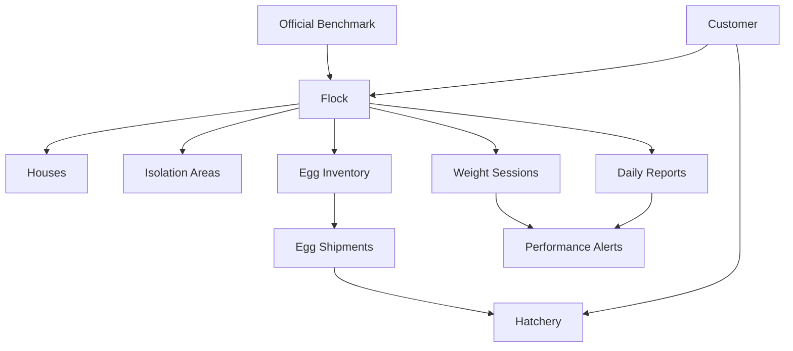

# Breeder Flock Performance Design

Date: 2026-08-27

Status: Revised 2026-08-27 after written-spec review; awaiting implementation
plan

Scope: Replace the existing Broiler Performance area with complete Breeder Flock Performance management.

## 1. Purpose

ChickMark will manage a breeder flock from placement at day one through final depletion. The feature will connect each customer to its flocks and each flock to its houses, daily operational reports, official performance benchmarks, egg inventory, and hatchery shipments.

This is a full replacement, not a rename of the current Broiler feature. The implementation must remove all obsolete Broiler, Farm, farm-visit, investigation, and corrective-action code, including the customer-side farm-management screen, because Farm and Flock collapse into one term as described in section 2.1. No compatibility layer or unused placeholder code will remain.

Hatchery results are explicitly out of scope for this phase. Egg dispatch to a hatchery remains in scope so that later hatchery-result integration can use clean historical shipment data.

## 2. Approved business hierarchy

### 2.1 Farm and Flock are one term

In this business a farm **is** a flock. The two words name the same thing: one
site, populated on one day, run as one production cycle. The app must not model
them as two levels, and the user interface must not ask the user to create a
farm and then a flock inside it.

Consequences for the data model:

- The `farms` table is removed. There is no Farm entity, no farm identifier on
  a flock, and no query that joins through a farm.
- Houses belong to the flock. `houses.farmId` becomes `houses.flockId`, and a
  house row exists for exactly one flock.
- `flock_placements` is removed. With houses owned by the flock, a separate
  placement association adds nothing; the per-house, per-sex opening bird
  counts move onto the house row itself, and `flocks.entryDate` is the single
  placement date for all of them.
- `flocks.farmId` is removed.
- `customer_sectors` is kept. It records which sectors a customer runs and is
  independent of the farm/flock collapse.

Each production cycle is a **new flock record**. When a site is repopulated
after depletion, the user creates a new flock with its own houses; the previous
flock and all of its reports, ledgers, and alerts stay intact as history. Site
identity across cycles is carried by the flock name and the customer, not by a
persistent site row. A house therefore never spans two cycles, which keeps
every bird ledger, egg ledger, and benchmark comparison scoped to a single
flock with no cross-cycle leakage.

Creating a flock includes creating its houses in the same flow, so house setup
is part of flock creation rather than a separate farm-management screen.

## 3. Lifecycle and age

The feature covers:

- rearing;
- pre-production;
- production;
- partial depletion; and
- final depletion.

`breeder_flock_milestones` records operational events such as grading, physical transfer, light stimulation, first egg, 5% production, 50% production, peak production, partial depletion, start of depletion, and final depletion.

Depletion is never forced at 65 weeks or any other fixed age. The official guide age is a reference only. Actual partial and final depletion events control the flock state. The existing `flocks.depletionAgeWeeks` column (default 65) is not read by any Breeder Performance behaviour and is scheduled for removal in a later cleanup; nothing in this feature may reintroduce a fixed depletion age.

Total age is calculated from `flocks.entryDate`. Production week is not based on a manually entered production-start date, physical transfer, or first egg. It is obtained from the official benchmark profile for the flock's breed and version. For example, the Ross 308 Parent Stock objectives map flock age 25 weeks to production week 1 and flock age 34 weeks to production week 10. Other official profiles may provide a different mapping.

Before the official production range begins, the production-week field is empty and the flock is displayed as pre-production.

### 3.1 Comparison axis when a flock runs off the official schedule

Real flocks are light-stimulated earlier or later than the guide assumes, so a
flock's true production week can differ from the age-based lookup. The
age-based official mapping remains the default comparison axis for every flock.

In addition, when the flock's recorded 5%-production milestone differs from the
official profile's 5%-production age by more than one week, the app also offers
a milestone-aligned axis that shifts the benchmark rows by that difference.
The two axes are presented side by side and never silently substituted, and
every stored comparison, alert, and export records which axis produced it
alongside the benchmark profile version.

There is still no manually entered production-start date. The alternative axis
is derived only from the recorded `breeder_flock_milestones` 5%-production
event, which is operational evidence rather than free-text configuration.

## 4. Official benchmarks

Benchmarks are versioned database data, not constants in application code. Only official breed-company values are supported. Customers cannot override or edit them.

### 4.1 Tables

`breeder_metric_definitions` defines the stable metric code, label, unit, sex scope, period type, aggregation method, and display precision.

`breeder_benchmark_profiles` identifies the company, breed, product/variant, official guide version, publication date, source URL, effective range, lifecycle coverage, and state (`draft`, `active`, or `archived`). Published versions are immutable.

`breeder_benchmark_values` stores one official value for a profile, metric, age, and applicable sex. It supports:

- `ageDays`;
- `ageWeek`;
- `productionWeek` when officially provided;
- `periodType` (`daily`, `weekly`, or `cumulative`);
- target value;
- official lower and upper values only when the source provides them; and
- unit inherited from the metric definition.

The database must support at least these official metrics when supplied by the source:

- female and male body weight;
- uniformity and coefficient of variation;
- daily and cumulative feed per bird;
- water and water-to-feed ratio;
- male-to-female ratio;
- mortality, culls, and livability;
- age at production milestones;
- total eggs;
- hen-day and hen-housed production;
- settable or hatching eggs;
- reject, floor, dirty, cracked, small, and oversized eggs;
- egg weight;
- fertility;
- hatch of all eggs and hatch of fertile eggs;
- weekly and cumulative chicks; and
- numeric chick-quality targets when an official source supplies them.

Each comparison records the benchmark profile version used so later official releases do not rewrite historical interpretation.

### 4.2 Sources

Initial benchmark data must be transcribed and verified against primary official publications, including:

- [Aviagen Ross 308 Parent Stock Performance Objectives](https://ross-na.aviagen.com/assets/Tech_Center/Ross_PS/Ross308-ParentStock-PerformanceObjectives-2021-EN.pdf)
- [Aviagen Ross Parent Stock Production Pocket Guide](https://aa-intl.aviagen.com/assets/Tech_Center/Ross_PS/Ross_PS_PocketGuide_Production_2024-EN.pdf)
- [Cobb Breeder Management Guide](https://www.cobbgenetics.com/assets/Cobb-Files/80a75d5bbe/Breeder-Management-Guide.pdf)

**Correction, 2026-08-27:** only the first of these is a usable source. Both
the Ross Pocket Guide and the Cobb Breeder Management Guide were fetched and
read in full during implementation, and neither publishes an age-indexed
performance-objectives table. They are husbandry and management manuals. The
few age-linked numbers they contain are labelled by their own publishers as
examples or estimates, and the Cobb guide states outright that its bodyweight
profile lives in a separate document. Importing those figures as official
targets would be fabrication.

A usable source is a numeric **performance objectives** document — a table of
targets by age — not a management guide. Ross 308 Parent Stock Performance
Objectives is the model. The equivalent Cobb document (a breeder performance
and nutrition supplement) and any tabular Ross Parent Stock objectives release
must be obtained before those breeds can be supported. Until then a flock of
those breeds has no benchmark profile, which is the correct behaviour: the app
shows no target rather than a wrong one.

Source values require a verification fixture or import test that compares row counts, representative ages, units, and cumulative values with the referenced publication.

Transcribing three full official guides is the largest single cost in this
feature and must be planned as its own deliverable, not as a side effect of
schema work.

### 4.3 Ingestion path

Benchmark data enters the system as versioned data files, never as Dart
constants and never through client writes:

- Each profile version is one checked-in data file under `assets/benchmarks/`,
  named for company, breed, product, and guide version, in a flat row format
  (metric code, age unit and value, sex, period type, target, optional official
  lower and upper bounds).
- On fresh install and on schema upgrade, an importer loads the asset files
  into `breeder_benchmark_profiles` and `breeder_benchmark_values`. Import is
  idempotent and keyed by profile identity plus version, so re-running it never
  duplicates or mutates an already-published version.
- The same asset files are the source for a Supabase seed migration, so cloud
  and local hold byte-identical values. Benchmarks never travel upward from a
  client; the client only reads them.
- The verification fixture asserts, per profile: total row count, the presence
  of every metric the profile claims to cover, unit agreement with
  `breeder_metric_definitions`, a set of hand-checked spot values at named ages,
  and that cumulative **count** series are non-decreasing. Cumulative
  percentage series are not monotonic — cumulative hatchability legitimately
  falls as a flock ages — so the monotonic check applies to counts only.
- Every metric records its provenance: the source table, the exact published
  column heading, and any footnote qualifying that column. A published heading
  is never renamed to a more familiar industry term. The Ross 308 objectives
  publish a Hen-Week column rather than a Hen-Day one, and it is stored and
  labelled as Hen-Week, with the mortality assumption its footnote states.
- Where a source publishes a range rather than a single figure, the target is
  stored empty and only the official bounds are kept. Rearing liveability,
  published as a 95-96% range, is stored this way.

The Aviagen and Cobb performance tables are third-party publications. Before
release, their inclusion and redistribution inside a commercial application
must be confirmed against each publisher's terms; this is a release
prerequisite, not an implementation detail.

## 5. Daily report

There is one `breeder_daily_reports` header per flock and calendar date. It contains all houses and isolation areas. Houses are stored as child rows so they can be analyzed individually while the UI and export present a single flock report.

Daily reporting is optional. A missing report means missing data, never a zero-value report. Weekly and cumulative output remains available but is marked `Incomplete Data`, with recorded and missing day counts. Missing values are never imputed.

### 5.1 Adaptive lifecycle form

During rearing the report shows bird movements, feed, inside and outside temperature, light hours, and notes. Egg-production and egg-inventory sections appear when the benchmark profile enters its official production range.

Periodic weight and uniformity entry is a separate workflow linked to flock, house, sex, and date.

### 5.2 Report fields

The production report implements the currently approved paper-report data, without adding mandatory operational fields that do not appear in it.

Header:

- date and day;
- breed;
- calculated total age;
- official production week;
- inside temperature;
- outside temperature; and
- free-text daily notes.

Female movement by house and isolation:

- opening balance;
- mortality;
- culls/sorts;
- sale;
- kitchen removal;
- transfer; and
- closing balance.

Male movement by house and isolation:

- opening balance;
- mortality;
- culls/sorts;
- sale;
- euthanasia;
- transfer; and
- closing balance.

Feed by house:

- female feed kilograms and calculated grams per female; and
- male feed kilograms and calculated grams per male.

Egg production by house:

- first grade and percentage;
- second grade and percentage;
- sort/reject and percentage;
- double yolk and percentage;
- cracked and percentage;
- damaged and percentage;
- calculated total eggs;
- calculated production percentage;
- egg weight; and
- lighting hours.

Egg inventory by grade:

- previous balance;
- today's production;
- calculated available balance;
- dispatched to hatchery;
- sold;
- kitchen;
- gifts; and
- calculated closing balance.

Egg grades are system-defined database records in `breeder_egg_grade_definitions`, not UI-only strings.

Grades are a strict partition: every laid egg is counted in exactly one grade,
so the grade counts always sum to total production. Real eggs can satisfy more
than one description — a cracked double-yolk is both — so each grade definition
carries a priority, and an egg is counted under the highest-priority grade it
matches. The definition table stores that priority and the entry UI states the
rule, because without it the "grades must sum to total" validation in section
14 cannot be satisfied.

### 5.2.1 Units

- Inside and outside temperature follow the existing per-sector temperature
  convention rather than a global app setting, and the unit is labelled on each
  field.
- Feed is entered in kilograms and derived feed per bird is reported in grams.
- Egg weight is in grams.
- Every stored value keeps its canonical unit; display conversion never changes
  what is persisted.

### 5.3 Mobile workflow

Entry is house-by-house, with isolation areas as separate locations. The final review transforms the entries into one table matching the familiar paper report. A user can return from the table to correct entries before submission. The consolidated review table is the same view used for printing and export, and it renders correctly in Arabic right-to-left as well as English.

The report state machine, including sync outcomes, is:

`Draft -> Submitted -> Approved -> Revised -> Approved`

`Sync Conflict` is reachable from any of those states when a push is rejected.
A report in `Sync Conflict` can be viewed and resolved but cannot be submitted
or approved. Resolving a conflict returns the report to the state it held
before the conflict was detected.

Data-entry users create and submit reports. Final approval requires a
production-manager role or higher. Roles live in the existing `users.role`
column, and the permitted approval roles are an enumerated, documented set
rather than an open string. Approval is enforced in the cloud as well as the
client: the Supabase policy for the approval transition checks the actor's
role, so a modified or offline client cannot approve a report that its role
does not permit. If the role set proves insufficient, defining it is a
prerequisite of this feature, not an assumption it may make.

Draft reports can be edited normally. Any correction after approval requires a reason and creates permanent revision history containing actor, time, old value, and new value. Reports use the latest approved revision for current calculations.

## 6. Bird inventory and isolation

The system calculates bird balances for females and males separately at house, isolation, and flock levels.

The core balance is:

`live balance = placement + inbound transfers - mortality - culls - sales - kitchen/euthanasia - outbound transfers - depletion +/- approved physical-count adjustments`

Multiple named isolation areas are supported. A transfer from a house to isolation decreases the active house count and increases the isolation count but does not change total physically live flock birds. Mortality or permanent removal inside isolation reduces the total flock count.

The UI reports both:

- live birds in production houses;
- live birds in isolation; and
- total physically live birds in the flock.

Which of these balances feeds each ratio is fixed in section 7.1: house-level
denominators exclude isolation, and isolation figures are reported on their own
rows rather than merged into house performance.

Physical-count adjustments require a reason, actor, time, and revision entry. Balances are derived from movements and cannot be silently overwritten.

## 7. Calculations

All formulas live in one tested domain service and are reused by entry, reports, alerts, and export.

- `closing birds = opening birds - permanent removals +/- transfers`
- `feed grams per bird = feed kilograms * 1000 / applicable live birds`
- `total eggs = sum of all egg-grade counts`
- `daily production percent = total eggs / closing live females * 100`
- `egg-grade percent = grade count / total eggs * 100`
- `available egg balance = previous balance + today's production`
- `closing egg balance = available balance - hatchery dispatch - sale - kitchen - gifts +/- approved adjustments`

### 7.1 Denominators

Every ratio names its denominator explicitly:

- `daily production percent` divides by the **closing live-female count in
  production houses**, matching the approved operating report.
- `feed grams per female` divides by the **closing live females in that house**;
  `feed grams per male` divides by the closing live males in that house.
  Isolation areas are excluded from house feed denominators because isolation
  birds are fed separately; isolation feed, when recorded, is reported against
  isolation bird counts on its own row.
- Isolation females are excluded from the production-percent denominator, and
  eggs collected from isolation are likewise excluded from its numerator, so
  the ratio stays internally consistent. Isolation production, when recorded,
  is reported separately and never folded into the house figure.
- `egg-grade percent` divides by calculated total eggs for the same scope.

The denominator actually used is retained in the approved report snapshot for
auditability, together with the benchmark profile version and comparison axis.

### 7.2 Empty denominators

A zero, negative, or missing denominator yields a blank derived value, never
`0` and never an error. This matches the existing `CalculationUtils.percentOf`
behaviour in the shared calculation utilities, which returns null for
non-positive totals; the breeder domain service reuses those utilities rather
than defining its own rounding, percentage, standard-deviation, or coefficient-
of-variation behaviour.

### 7.3 Known bias against official targets

The approved paper report divides by closing live females, while official
hen-day and hen-housed production are defined on different denominators —
typically average hens present for hen-day and originally housed hens for
hen-housed. The app keeps the paper-report definition because that is what the
operation actually runs on, and therefore any comparison against the official
target carries a small systematic bias, larger in weeks with heavy mortality or
depletion. The comparison view states this, and the retained denominator makes
the difference reconstructable after the fact. The official values are never
recomputed onto the local denominator.

Inputs are the source of truth. Derived balances, totals, ratios, ages, and percentages are not independently editable.

## 8. Egg batches, inventory, and hatchery dispatch

`egg_batches` represents egg production for a flock and collection date. `egg_batch_house_sources` records the optional contribution of each house. `breeder_egg_inventory_movements` is the inventory ledger by grade.

`egg_shipments` and `egg_shipment_batches` record dispatch to a customer hatchery. `egg_batch_receipts` records received quantities and differences. Creating an approved hatchery dispatch produces the corresponding inventory movement. The system cannot dispatch more than the available grade balance.

Correction or cancellation after approval uses a documented reversing movement rather than destructive deletion.

Setter, hatcher, audit, fertility, hatchability, chick, and breakout results are not connected to Breeder Performance in this phase. No result-link placeholder tables or unused code will be added.

## 9. Weight and uniformity

`breeder_weighing_sessions` records flock, house, date, sex, weighing method, and sample size. `breeder_weighing_samples` optionally records individual bird weights.

The system calculates mean weight, uniformity, and coefficient of variation from individual samples when present, compares results with the official profile, and preserves the exact benchmark version used. Standard deviation and coefficient of variation reuse the existing shared calculation utilities so breeder figures match the rest of the app rather than introducing a second convention.

## 10. Alerts

Official benchmark values and operational alert thresholds are separate concepts.

`breeder_alert_rules` stores system-wide Watch and Critical deviation rules by metric, direction, scope, period, and required consecutive observations. These thresholds must never be presented as Aviagen, Cobb, or other official limits unless the source explicitly provides them.

`breeder_performance_alerts` stores the affected customer, flock, optional house, metric, period, actual value, official target, deviation, severity, benchmark profile, evidence reference, and state (`new`, `seen`, or `closed`).

At most one open alert exists per customer, flock, optional house, metric, and
period. A repeat evaluation that matches an already-open alert updates that
alert's actual value, deviation, and severity instead of creating a second row.

When an approved report is revised, every alert whose evidence includes the
revised date is recomputed. An alert whose condition no longer holds is closed
with a system reason recording the revision that cleared it, rather than
deleted, so the alert history stays auditable.

Alerts do not create visits, investigations, cause assessments, or corrective actions.

## 11. Screens

The old Broiler Performance navigation is replaced by a Breeder Performance area inside each flock:

1. Overview: current inventory, production, feed, mortality, benchmark comparisons, data completeness, and open alerts.
2. Daily Reports: list, create, continue, submit, approve, revise, and view daily or weekly output.
3. Weight & Uniformity: weighing sessions and official target comparisons.
4. Egg Stock & Shipments: inventory movements, hatchery dispatch, receipt, and variances.
5. Alerts: Watch and Critical deviations with acknowledge and close actions.
6. Official Benchmark: read-only source, version, ages, and values.

The app uses a mobile-friendly house-by-house editor and a consolidated review/print view. That consolidated view is in scope as a printable and exportable document, and it must lay out correctly in both Arabic right-to-left and English.

## 12. Data model

Target tables for this feature are:

- `breeder_flock_milestones`
- `breeder_metric_definitions`
- `breeder_benchmark_profiles`
- `breeder_benchmark_values`
- `breeder_daily_reports`
- `breeder_bird_movements`
- `breeder_feed_entries`
- `breeder_egg_grade_definitions`
- `breeder_egg_production_entries`
- `breeder_egg_inventory_movements`
- `breeder_report_revisions`
- `breeder_isolation_areas`
- `breeder_weighing_sessions`
- `breeder_weighing_samples`
- `egg_batches`
- `egg_batch_house_sources`
- `egg_shipments`
- `egg_shipment_batches`
- `egg_batch_receipts`
- `breeder_alert_rules`
- `breeder_performance_alerts`

The existing `houses` table is reshaped rather than replaced: it hangs off
`flockId`, carries per-sex opening bird counts, and keeps its name and code
uniqueness within the flock.

Detailed columns, constraints, and indexes will be specified in the implementation plan. The following invariants are mandatory:

- unique daily report per flock and date;
- non-negative counts, weights, and quantities;
- a bird movement belongs to exactly one valid flock location;
- balanced internal transfers with equal source and destination quantities;
- a house or isolation area must belong to the report's flock, and a house
  belongs to exactly one flock;
- no egg dispatch beyond available inventory;
- unique egg-grade priority within the active grade set;
- one open performance alert per customer, flock, house, metric, and period;
- immutable published benchmark versions;
- immutable approved revision entries;
- indexed foreign keys and common date/status filters; and
- customer ownership traceable for every operational row.

## 13. Offline sync, security, and conflicts

SQLite remains the working store and Supabase the cloud mirror. Sync is per row and dirty-tracked using the repository's existing cutoff-safe pattern. Local sync bookkeeping remains local-only and is removed from cloud payloads.

Official benchmarks sync down for offline read access. Client roles cannot create, update, or delete published benchmark data. Operational data is customer-scoped with RLS ownership predicates; authentication alone is not authorization.

Concurrent offline editing uses optimistic concurrency. Each report has a revision number. A push succeeds only when the cloud base revision matches. Conflicting edits are both preserved, the report enters `Sync Conflict`, and a production manager selects or merges the correct data. A report with an unresolved conflict cannot be approved.

### 13.1 The daily report is a sync aggregate

A daily report is not a row; it is a header plus bird movements, feed entries,
egg production entries, and inventory movements. A revision number on the
header alone would not protect those children if they were pushed
independently, because a stale child could land after a winning header.

The report is therefore pushed as one aggregate: header and all child rows
travel in a single transaction guarded by the header revision, and the cloud
side replaces the whole child set for that report within that transaction. A
child row is never individually dirty-pushed.

This is an addition to the repository's existing per-row dirty-tracked sync,
not something that pattern provides for free, and it must be built and tested
as such. The existing cutoff-safe mark-synced behaviour and the rule that local
sync bookkeeping is stripped from cloud payloads both still apply.

Preserved conflicting versions are stored in the existing `sync_conflicts`
table rather than in a new feature-specific conflict store.

Report approval validates all child data atomically. Revisions are commercial audit history and sync to Supabase; `syncStatus`, `dirtyAt`, `lastSyncedAt`, and `syncError` remain local synchronization metadata.

## 14. Validation and incomplete data

- Negative quantities are rejected.
- A transfer must have balanced source and destination legs.
- Opening balances derive from previous ledger state.
- Egg grades must sum to calculated total production.
- Inventory equations must balance before approval.
- Missing days are permitted and never auto-created as zero days.
- Weekly and cumulative calculations identify missing dates and display `Incomplete Data`.
- Partial results may be compared with the official benchmark only with a visible partial-data warning.
- Reports containing internal inconsistencies or unresolved sync conflicts cannot be approved.

## 15. Replacement and migration

The current project is in its testing phase. For this plan only, losing existing local Performance test data is acceptable when required for a clean migration. This does not authorize indiscriminate deletion elsewhere.

The implementation will:

- create the next guarded SQLite schema migration and update fresh-install schema, surgical-repair columns, and schema-version tests together;
- remove current Broiler Performance tables and their data;
- remove the complete farm-visit, investigation, finding, assessment, corrective-action, and action-evaluation schema;
- remove obsolete Broiler/Farm models, repositories, providers, services, screens, widgets, routes, localization entries, sync mapping, tests, and documentation;
- collapse Farm into Flock: repoint `houses` from `farmId` to `flockId`, move opening bird counts onto the house row, then drop `farms`, `flock_placements`, and `flocks.farmId`;
- verify whether the existing Supabase Broiler migration is truly unapplied before removing or replacing it;
- create a clean Supabase migration with RLS, grants, indexes, constraints, and storage/sync support;
- add no compatibility layer and leave no dead code; and
- leave hatchery-result integration absent until separately designed and approved.

Tables removed from the target feature include:

- `broiler_target_profiles`
- `broiler_target_rows`
- `broiler_daily_records`
- `broiler_daily_record_revisions`
- `daily_record_sources`
- `broiler_daily_events`
- `performance_alert_rules`
- `performance_concerns`
- `farm_visit_sessions`
- `farm_visit_houses`
- `visit_investigations`
- `visit_findings`
- `cause_assessments`
- `corrective_actions`
- `action_kpi_evaluations`
- `farms`
- `flock_placements`

`customer_sectors` is kept unchanged.

`houses` is kept but reshaped: `farmId` is replaced by `flockId`, per-sex
opening bird counts are added, and its uniqueness indexes move from
`(farmId, name)` and `(farmId, code)` to the flock equivalents. Because Farm
and Flock are one term, the customer-side farm-management screen and the
farm-shaped parts of the poultry hierarchy repository go away with the `farms`
table; house setup moves into flock creation.

Code removed alongside the schema includes the farm management sheet, the farm
model and its sync mapping, the farm and placement methods on the poultry
hierarchy repository, the broiler flock-with-placements creation path, and the
customer-detail entry point that opened farm management.

### 15.1 Delivery phases

The replacement ships in gated phases rather than one change, matching the
repository's incremental-refactor practice. Each phase must leave the app
analysing and testing clean before the next begins, and a failing gate stops
the sequence instead of being carried forward:

1. Metric definitions, benchmark profiles and values, plus the asset files,
   importer, and verification fixtures.
2. The Farm-into-Flock collapse: repoint `houses` to `flockId`, move opening
   bird counts onto the house row, drop `farms`, `flock_placements`, and
   `flocks.farmId`, and fold house setup into flock creation.
3. Schema for reports, movements, feed, egg production, inventory, revisions,
   isolation areas, weighing, batches, shipments, and alerts, with the guarded
   SQLite migration and Supabase migration.
4. The calculation domain service and its unit tests, with no UI.
5. House-by-house entry, consolidated review, and the remaining screens.
6. Aggregate sync, optimistic concurrency, conflict handling, and RLS.
7. Alerts.
8. Removal of the Broiler, farm-visit, investigation, and corrective-action
   code, schema, routes, translations, and tests.

## 16. Testing

The implementation requires focused unit, repository, migration, sync, RLS, and widget coverage for:

- age and production-week lookup by official profile, and the milestone-aligned
  alternative comparison axis;
- benchmark asset import: idempotence, row counts, unit agreement, spot values,
  and monotonic cumulative count series;
- empty-denominator handling producing blank rather than zero values;
- egg-grade partition and priority resolution for overlapping descriptions;
- aggregate report push, including rejection of a stale child row;
- role-gated approval enforced in cloud policy, not only in the UI;
- alert dedupe and recomputation after a post-approval revision;
- bird ledger calculations for female, male, house, isolation, and flock scopes;
- partial depletion and final depletion;
- feed-per-bird calculations;
- egg-grade totals and percentages;
- egg inventory and hatchery dispatch;
- missing-day completeness behavior;
- Draft, Submitted, Approved, revised, and conflicted report states;
- post-approval revision history;
- benchmark immutability and version retention;
- alert generation and severity thresholds;
- optimistic-concurrency conflict preservation and resolution;
- customer-scoped RLS and read-only official benchmark access;
- the Farm-into-Flock collapse: houses repointed to their flock, opening counts
  preserved, and no surviving reference to `farms`, `flock_placements`, or
  `flocks.farmId`;
- upgrades from the current SQLite version and clean installs; and
- removal of old routes, symbols, tables, sync mappings, translations, and dead code.

## 17. Acceptance criteria

The replacement is complete when:

1. A user can manage breeder performance from day one through partial and final depletion, creating a flock and its houses in one flow, with no Farm concept anywhere in the data model or the interface.
2. A production report matching the approved paper report can be entered house-by-house, reviewed as one table, submitted, approved, printed, and revised with history.
3. Bird and egg ledgers balance automatically, including multiple isolation areas.
4. Official database benchmarks drive age mapping and comparisons without code constants or customer overrides.
5. Missing daily reports remain allowed and visibly produce incomplete weekly/cumulative results.
6. Egg dispatch reaches a hatchery and affects inventory, while hatchery results remain out of scope.
7. Alerts compare recorded performance with the official benchmark while clearly separating system thresholds from official targets.
8. Offline edits synchronize without silently overwriting concurrent work.
9. Old Broiler, Farm, farm-visit, investigation, and corrective-action code and schema are absent, `farms` and `flock_placements` are gone, and `houses` hangs off the flock.
10. Every ratio names its denominator, blanks rather than zeroes on an empty denominator, and records the denominator, benchmark version, and comparison axis it used.
11. Relevant analysis and tests pass, and `docs/LIVING_SPEC.md` plus `docs/CHANGELOG.md` describe the implemented result when implementation occurs.
